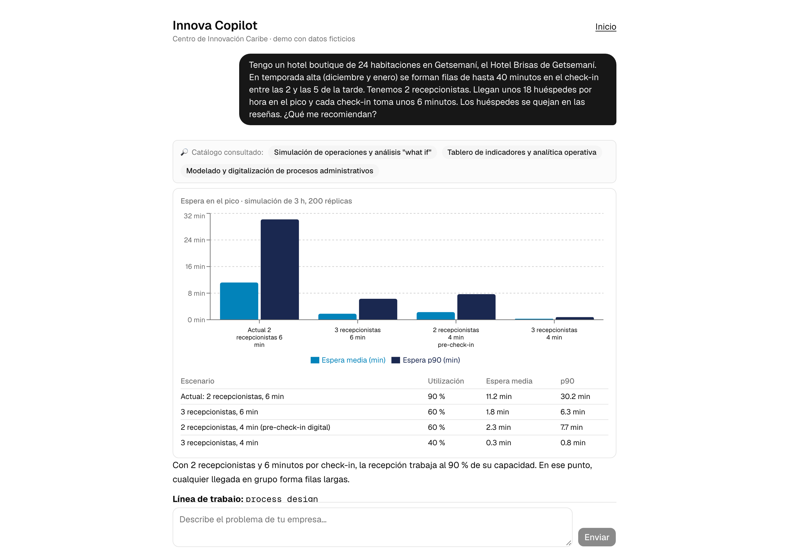
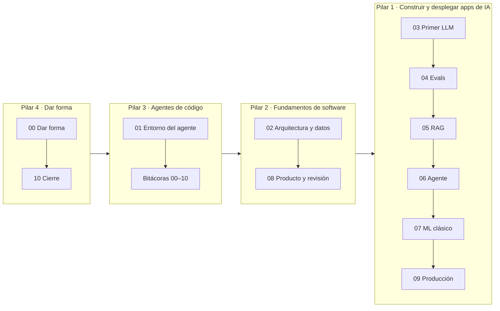

# Innova Copilot

**El AI Engineering Skills Map aplicado paso a paso en un proyecto real: un copiloto de IA para MIPYMES, construido con un agente de código.**

[](https://github.com/FutureTales/ai-engineering-demo/actions/workflows/ci.yml)
[](LICENSE)
[](https://innova-copilot.vercel.app)

## 👉 [Probar la app en vivo: innova-copilot.vercel.app](https://innova-copilot.vercel.app)

> ⚠️ **Demo educativa.** No es un servicio oficial de ninguna institución. El "Centro de Innovación Caribe", sus servicios, sus precios y todas las MIPYMES son **ficticios**. No escribas datos personales sensibles en el chat.

> 🔑 **Usa tus propias claves.** La app pública no paga el uso de nadie: sin clave funciona en **modo demo** (el caso del hotel, grabado, gratis). Para conversar con el modelo real sobre tu propio caso, pega **tu** clave de Anthropic en `/copilot` ([cómo funciona y qué pasa con tu clave](#usa-tus-propias-claves)).

Una MIPYME cuenta su problema ("tengo filas de 40 minutos en el check-in de mi hotel"). El copiloto lo encuadra en una línea de trabajo, **busca en el catálogo** y recomienda servicios con su fuente, **simula escenarios "what if"** con una herramienta que sí calcula, y, con el permiso del usuario, deja una **pre-propuesta** para que un coordinador la revise en un panel.



## La idea de este repositorio

Las ~20 competencias del mapa de Andrew Ng no se aprenden por separado: **aparecen juntas en un proyecto real**. Por eso el proyecto se construyó en **11 pasos**, y cada paso es un **tag de git**. Cada uno tiene un documento que explica qué competencia aplica, qué se decidió y por qué, y una **bitácora** con los prompts exactos que recibió el agente de código y los errores que cometió.



## Los 11 pasos

| Paso | Tag | Qué se hace | Pilares | Doc |
|---|---|---|---|---|
| 00 | `paso-00-dar-forma` | Problema, usuarios, spec, métricas, decisión MVP | 4 | [📄](docs/pasos/paso-00-dar-forma.md) |
| 01 | `paso-01-entorno-agente` | CLAUDE.md, permisos, hooks, skills, subagente revisor, CI | 3 | [📄](docs/pasos/paso-01-entorno-agente.md) |
| 02 | `paso-02-arquitectura-datos` | Next.js, Supabase con RLS, catálogo, primer deploy, ADRs | 2 | [📄](docs/pasos/paso-02-arquitectura-datos.md) |
| 03 | `paso-03-primer-llm` | Chat con un solo prompt; tokens, caché y cuándo inventa | 1 | [📄](docs/pasos/paso-03-primer-llm.md) |
| 04 | `paso-04-evals` | 30 casos, chequeos deterministas, juez LLM, línea base | 1 | [📄](docs/pasos/paso-04-evals.md) |
| 05 | `paso-05-rag` | RAG híbrido con citas: 37 % → 100 % sin precios inventados | 1 | [📄](docs/pasos/paso-05-rag.md) |
| 06 | `paso-06-agente` | Herramientas, simulación de colas, aprobación humana, guardrails, modo mock | 1 · 2 | [📄](docs/pasos/paso-06-agente.md) |
| 07 | `paso-07-ml-clasico` | TF-IDF frente a Claude Haiku en el mismo test | 1 · 4 | [📄](docs/pasos/paso-07-ml-clasico.md) |
| 08 | `paso-08-producto-completo` | Panel con login, CI completo, **revisión agéntica** | 2 · 3 | [📄](docs/pasos/paso-08-producto-completo.md) |
| 09 | `paso-09-produccion` | Salud del asistente, drift, control de regresión, runbook | 1 · 2 | [📄](docs/pasos/paso-09-produccion.md) |
| 10 | `paso-10-cierre` | Memo, retrospectiva, roadmap y slides | 4 | [📄](docs/pasos/paso-10-cierre.md) |

Para ver el proyecto **exactamente** como estaba en un paso:

```bash
git clone https://github.com/FutureTales/ai-engineering-demo.git && cd ai-engineering-demo
git checkout paso-05-rag      # o cualquier otro tag
```

**Mapa completo competencia → paso → archivo:** [`docs/mapa-de-habilidades.md`](docs/mapa-de-habilidades.md)

## Resultados (medidos, no estimados)


| | Paso 03 (solo prompt) | Paso 05 (RAG) | Paso 06 (agente) |
|---|---|---|---|
| Casos que pasan todos los chequeos (de 30) | 3 | 24 | **29** |
| Sin precios inventados | 36,7 % | 100 % | 100 % |
| Simula en los casos de filas | 0/5 | 0/5 | 4/5 |

Cada número sale de un archivo en [`evals/results/`](evals/results/). El [análisis de errores](docs/analisis-de-errores.md) explica qué falló, incluidos los errores **de la propia eval**.

## Cómo correrlo en 5 minutos (sin claves)

Requisitos: Node.js 20 o superior y pnpm.

```bash
git clone https://github.com/FutureTales/ai-engineering-demo.git && cd ai-engineering-demo
pnpm install
AI_MODE=mock pnpm dev
# abre http://localhost:3000/copilot → botón "Hotel con filas en el check-in"
```

El **modo mock** reproduce una conversación real grabada del caso del hotel, pero con las herramientas de verdad: la simulación, la búsqueda en el catálogo (offline) y la aprobación. No necesita red ni claves de API.

También sin claves:

```bash
pnpm test          # 65 tests unitarios
pnpm test:e2e      # Playwright en modo mock (escritorio y celular)
pnpm eval --mock   # reproduce la última corrida de evals
```

**Versión completa** (tus propias claves, tu base de datos y tu despliegue): [`docs/setup.md`](docs/setup.md).

## Usa tus propias claves

Este proyecto **no subsidia** el uso de APIs. Hay tres formas de probarlo:

| Forma | Necesitas | Costo para ti |
|---|---|---|
| **Modo demo** en https://innova-copilot.vercel.app | Nada | Cero: respuestas grabadas del caso del hotel, con las herramientas reales |
| **Tu clave en la app pública** | Una clave de Anthropic ([console.anthropic.com](https://console.anthropic.com/settings/keys)); la de Voyage es opcional | Lo que consuma tu conversación, en tu cuenta (unos centavos de dólar; lo ves en "Bajo el capó") |
| **Tu propia copia** | Cuentas de Vercel, Supabase y Anthropic | Tus planes y tu uso; control total |

**Qué pasa con tu clave en la app pública:** se guarda solo en esa pestaña del navegador y se borra al cerrarla; viaja por HTTPS en cada mensaje; el servidor la usa para responder y **no la guarda ni la registra**. El código está aquí para verificarlo ([`lib/ai/credentials.ts`](lib/ai/credentials.ts), [ADR 0006](docs/adr/0006-trae-tu-propia-clave.md)). Recomendación: crea una clave nueva solo para probar, con límite de gasto, y bórrala después.

**Tu propia copia:** [](https://vercel.com/new/clone?repository-url=https%3A%2F%2Fgithub.com%2FFutureTales%2Fai-engineering-demo&project-name=mi-innova-copilot)

Recién desplegada, tu copia funciona en modo demo sin configurar nada. Para el modelo real, la base de datos y el panel, sigue [`docs/setup.md`](docs/setup.md).

## Qué hay en el repo

| Carpeta | Contenido |
|---|---|
| [`app/`](app/), [`components/`](components/), [`lib/`](lib/) | La app: Next.js, agente (`lib/ai`), herramientas (`lib/tools`), RAG (`lib/rag`), guardrails, telemetría |
| [`supabase/migrations/`](supabase/migrations/) | Esquema, RLS, búsqueda híbrida |
| [`data/catalog/`](data/catalog/) | Catálogo ficticio (10 servicios, 3 políticas) |
| [`evals/`](evals/) | Dataset, rúbrica, runner, resultados y grabaciones |
| [`ml/`](ml/) | Notebook de ML clásico (con salidas) y dataset sintético |
| [`docs/`](docs/) | Pasos, bitácoras, ADRs, arquitectura, runbook, glosario |
| [`presentacion/`](presentacion/) | Slides de la presentación (el caso práctico va en los slides 17–30) |
| [`.claude/`](.claude/), [`CLAUDE.md`](CLAUDE.md) | Configuración del agente de código: permisos, hooks, skills, subagente |

## Honestidad y limitaciones

- **Datos ficticios o sintéticos.** El catálogo, las empresas, los precios y el dataset de ML son inventados y están marcados como tales. Ningún resultado mide el efecto en una MIPYME real.
- **Muestras pequeñas.** 30 casos de eval y 36 de prueba de ML: una diferencia de 1 o 2 casos no es concluyente. La telemetría de producción tiene pocas conversaciones.
- **Revisión humana pendiente** de la muestra de evals ([`evals/human-review.csv`](evals/human-review.csv)) y del dataset de ML.
- **Límites conocidos:** ver [revisión agéntica](docs/revision-agentica.md) (riesgos aceptados), [runbook](docs/runbook.md) y [roadmap](docs/roadmap-v2.md).
- **Costo de API de la app durante el desarrollo** (evals, pruebas y scripts): ~US$ 4,6, calculado con los tokens registrados en el repo y los precios públicos. No incluye la sesión del agente de código (Claude Code) que construyó el proyecto; ese costo se consulta con `/cost` en Claude Code o en console.anthropic.com → Usage.
- Las ilustraciones conceptuales se generaron con IA y están rotuladas; los gráficos y las capturas son reales ([cómo se hicieron](docs/ilustraciones-con-ia.md)).

## Créditos

- **Serie *AI Engineering Skills Map*, de Andrew Ng** en *The Batch* (DeepLearning.AI, 2026):
  [Parte 1: el mapa](https://www.deeplearning.ai/the-batch/the-ai-engineering-skills-map) ·
  [Parte 2: construir y desplegar aplicaciones de IA](https://www.deeplearning.ai/the-batch/he-ai-engineering-skills-map-in-detail-building-and-deploying-ai-applications) ·
  [Parte 3: fundamentos de ingeniería de software](https://www.deeplearning.ai/the-batch/the-ai-engineering-skills-map-in-detail-software-engineering-fundamentals) ·
  [Parte 4: uso de agentes de código](https://www.deeplearning.ai/the-batch/the-ai-engineering-skills-map-in-detail-using-coding-agents) ·
  [Parte 5: dar forma a lo que se construye](https://www.deeplearning.ai/the-batch/the-ai-engineering-skills-map-in-detail-shaping-the-build)
- Construido con **Claude Code** por **Future Tales**.
- Presentado en la charla "AI Engineering Skills Map", **Unicolombo, Cartagena, 2026**.

Licencia [MIT](LICENSE).
