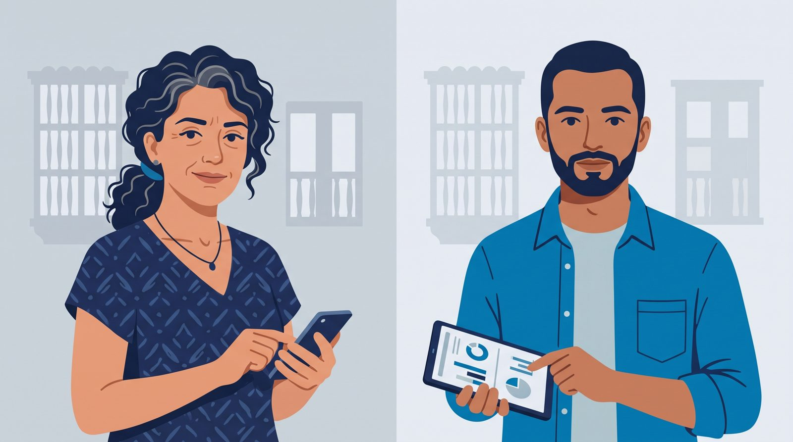

# Usuarios

> **Aviso:** las personas y las entrevistas de este documento son **simuladas**. Se escribieron para enseñar la técnica, no provienen de entrevistas reales. En un proyecto real, este paso se hace con usuarios de verdad antes de escribir código.

*Ilustración generada con IA (Gemini). Personajes ficticios. [Cómo se hizo](../ilustraciones-con-ia.md).*

## Persona 1: Marcela, dueña de MIPYME

| | |
|---|---|
| **Quién es** | Marcela Pérez, 44 años. Dueña del "Hotel Brisas de Getsemaní" (ficticio), 24 habitaciones en Cartagena |
| **Contexto** | Maneja el hotel con 9 empleados. Usa WhatsApp, Booking y una hoja de cálculo |
| **Su problema** | En temporada alta se forman filas en el check-in y aparecen quejas en las reseñas |
| **Qué quiere** | Saber si le conviene contratar otra persona o cambiar el proceso, y cuánto le costaría |
| **Qué le frustra** | Formularios largos, lenguaje técnico, esperar semanas por una respuesta |
| **Cómo mide el éxito** | "Que me digan algo concreto hoy, no en un mes" |

## Persona 2: Andrés, coordinador del centro de innovación

| | |
|---|---|
| **Quién es** | Andrés Castillo, 36 años. Ingeniero industrial, coordina la atención a empresas en el "Centro de Innovación Caribe" (ficticio) |
| **Contexto** | Atiende muchas solicitudes al mes, por correo, llamadas y eventos |
| **Su problema** | Pasa gran parte del tiempo entendiendo casos que no están bien descritos o que no son del centro |
| **Qué quiere** | Recibir casos ya encuadrados, con datos suficientes para decidir rápido |
| **Qué le preocupa** | Que la IA prometa servicios o precios que el centro no ofrece; la confidencialidad de los datos |
| **Cómo mide el éxito** | Más casos atendidos, propuestas más rápidas, menos casos mal encuadrados |

---

## Entrevista simulada 1: Marcela (dueña de MIPYME)

*Técnica: preguntar por el pasado concreto, no por opiniones sobre el futuro.*

**P: Cuénteme la última vez que tuvo un problema en el hotel que no supo resolver.**
M: En diciembre. Entre las 2 y las 5 de la tarde llegaban todos a la vez y la fila de recepción llegó a 40 minutos. Tengo dos recepcionistas. Una señora me puso una estrella en Booking por eso.

**P: ¿Qué hizo en ese momento?**
M: Puse a mi sobrino a ayudar, pero no sabe usar el sistema. Pensé en contratar otra recepcionista, pero no sé si con eso basta o si es plata perdida el resto del año.

**P: ¿Buscó ayuda afuera?**
M: Escuché que la universidad ayuda a empresas, pero no sé con qué ni cuánto cuesta. Escribí un correo y me respondieron a las dos semanas pidiéndome una reunión.

**P: Si alguien le hubiera respondido ese mismo día, ¿qué habría necesitado que le dijera?**
M: Si con una persona más se arregla, o si hay otra solución más barata. Y cuánto me costaría el estudio.

**Qué aprendimos (simulado):** necesita una respuesta **cuantitativa y rápida** ("¿con 3 recepcionistas cuánto espera la gente?") y un **rango de inversión**, no un catálogo.

---

## Entrevista simulada 2: Andrés (coordinador del centro)

**P: ¿Cómo fue la última solicitud que atendió?**
A: Un operador logístico escribió "tenemos problemas con los despachos". Tuve tres llamadas para entender que era un cuello de botella en el muelle de carga. Al final era un caso de simulación de operaciones, pero pudo haber sido rediseño de procesos.

**P: ¿Qué parte le quita más tiempo?**
A: Entender el caso y conseguir los números básicos: cuánta demanda, cuánto tarda cada operación, cuánta gente tienen. Con eso ya sé qué servicio aplica.

**P: ¿Qué le daría miedo de un asistente de IA?**
A: Que le diga a la empresa un precio que no manejamos o que prometa algo que no hacemos. Y que alguien meta datos personales de clientes sin necesidad.

**P: ¿Qué tendría que pasar para que confíe en él?**
A: Que cite de dónde saca cada servicio, que yo pueda ver todas las conversaciones y que alguien haya medido qué tan seguido se equivoca.

**Qué aprendimos (simulado):** el asistente debe **citar el catálogo**, **no inventar precios**, dejar todo **visible en un panel** y tener **métricas de calidad** (evals). Esto se convierte directamente en requisitos del MVP.

---

## De las entrevistas a los requisitos

| Hallazgo | Requisito (ver [spec-mvp.md](spec-mvp.md)) |
|---|---|
| Marcela quiere números hoy | RF-04: simulación "what if" en la conversación |
| Marcela no entiende el catálogo | RF-02/03: el copiloto encuadra y recomienda por ella |
| Andrés pierde tiempo entendiendo casos | RF-01: máximo 3 preguntas para completar datos clave |
| Andrés teme precios inventados | RNF-01: nunca precios fuera del catálogo; citas obligatorias |
| Andrés quiere ver todo | RF-06: panel `/panel` con solicitudes |
| Andrés quiere saber qué tan seguido falla | RNF-05: evals medidas y visibles |
