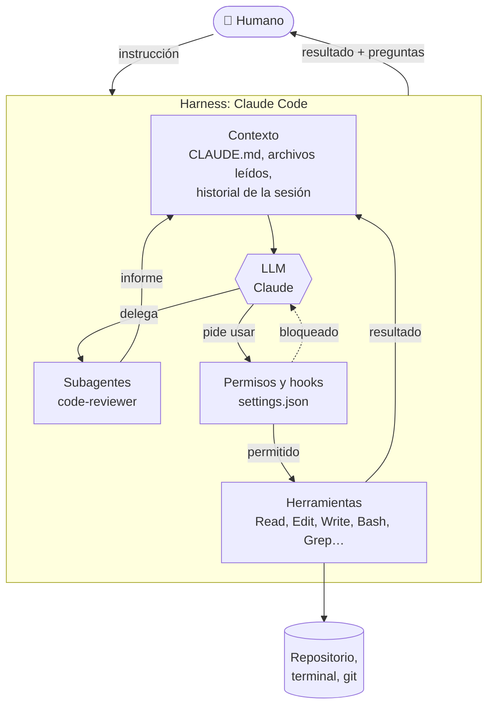

# Uso de agentes de código (Pilar 3)

Este proyecto se construyó con **Claude Code**, un agente de código que corre en la terminal. Este documento explica cada pieza que configuramos en el repo, **para qué sirve** y con qué competencia del pilar 3 se relaciona.

## Primero: ¿qué es un agente de código?

Un LLM por sí solo recibe texto y devuelve texto. No puede leer tu proyecto, correr tests ni editar archivos. Un **agente de código** es un programa (el *harness*) que envuelve al LLM y le da tres cosas:



1. **Contexto:** qué sabe el modelo en cada momento (instrucciones del proyecto, archivos que leyó, resultados de comandos).
2. **Herramientas:** acciones que puede pedir (leer, editar, correr comandos). El harness las ejecuta, no el modelo.
3. **Subagentes:** otras instancias del modelo con un contexto limpio y una tarea acotada, que devuelven solo su conclusión.

El ciclo es: el modelo **decide** qué herramienta usar → el harness **verifica permisos y corre hooks** → ejecuta → el resultado **vuelve al contexto** → el modelo decide el siguiente paso. Es el mismo patrón que usamos en la app (paso 06): el LLM decide, las herramientas ejecutan.

## Las piezas de este repo

| Pieza | Archivo | Para qué sirve | Competencia |
|---|---|---|---|
| Memoria de proyecto | [`CLAUDE.md`](../CLAUDE.md) | Arquitectura, comandos, reglas de idioma y de honestidad. El agente lo lee al iniciar cada sesión | Personalizar el agente y su entorno |
| Permisos | [`.claude/settings.json`](../.claude/settings.json) → `permissions` | **Permite** sin preguntar lo seguro (tests, lint, evals mock). **Niega** lo peligroso (leer `.env.local`, `rm -rf`, `git push --force`, resetear la base remota) | Habilitar autonomía |
| Hook anti-secretos | [`.claude/hooks/block-secrets.sh`](../.claude/hooks/block-secrets.sh) | Antes de cada escritura, busca patrones de claves. Si encuentra una, **bloquea** la escritura (exit 2) y le explica al agente por qué | Habilitar autonomía · Revisar el trabajo |
| Hook de formato | [`.claude/hooks/format-and-lint.sh`](../.claude/hooks/format-and-lint.sh) | Después de cada edición, corre prettier y eslint. Si eslint falla, el agente ve el error y lo corrige en el momento | Revisar el trabajo |
| Skill `/eval` | [`.claude/skills/eval/`](../.claude/skills/eval/SKILL.md) | Corre las evals y resume **solo** con números de los archivos de resultados | Dirigir el flujo · Revisar el trabajo |
| Skill `/nuevo-paso` | [`.claude/skills/nuevo-paso/`](../.claude/skills/nuevo-paso/SKILL.md) | Crea la documentación de un paso desde la [plantilla](pasos/_plantilla.md) | Dirigir el flujo |
| Skill `/revisar` | [`.claude/skills/revisar/`](../.claude/skills/revisar/SKILL.md) | Corre lint, tests y gitleaks, y delega la revisión al subagente | Revisar el trabajo |
| Subagente `code-reviewer` | [`.claude/agents/code-reviewer.md`](../.claude/agents/code-reviewer.md) | Revisor de solo lectura: seguridad, correctitud y pruebas. Con contexto limpio, no "se enamora" del código que escribió el agente principal | Revisar el trabajo · Fundamentos del agente |
| Bitácora | [`docs/bitacora/`](bitacora/) | Prompts exactos, comandos, decisiones humanas y errores de cada paso | Dirigir el flujo |
| CI + gitleaks | [`.github/workflows/ci.yml`](../.github/workflows/ci.yml) | Red de seguridad fuera del agente: aunque algo se escape localmente, CI lo detecta | Revisar el trabajo |

## Las 5 competencias del pilar, aterrizadas

### 1. Dirigir el flujo
El humano define **qué** y **cuándo detenerse**; el agente propone **cómo**. En este proyecto:
- La spec se aprobó antes de escribir código (paso 00).
- Hay solo **tres puntos de control humanos**: logins, aprobación de la spec y revisión de secretos antes del primer push público. Entre ellos, el agente trabaja solo.
- Cuando el plazo apretó, el humano decidió recortar alcance (pasos 07–09 más ligeros). El agente lo propuso; la persona decidió.

### 2. Habilitar autonomía
Más autonomía = menos interrupciones, pero solo si los límites son claros. Los permisos de `settings.json` hacen que el agente corra tests sin pedir permiso, pero **nunca** pueda leer las claves ni forzar un push. Los hooks agregan límites que no dependen de que el modelo "se acuerde" de las reglas: se ejecutan siempre.

> **Idea clave:** una regla en `CLAUDE.md` es una *petición* al modelo. Un hook o un permiso es una *garantía* del harness.

### 3. Revisar el trabajo
El agente escribe rápido; alguien tiene que verificar. Capas de revisión de este repo, de la más rápida a la más lenta:
1. Hook de formato y lint (en cada edición).
2. Tests y evals (en cada paso).
3. Subagente `code-reviewer` (antes de cerrar pasos con código).
4. CI con gitleaks (en cada push).
5. El humano, en los puntos de control.

### 4. Personalizar el agente y su entorno
`CLAUDE.md`, skills, subagentes, hooks y permisos convierten un agente genérico en uno que conoce **este** proyecto: sus comandos, su idioma, sus reglas de honestidad.

### 5. Fundamentos del agente de código
Entender qué pasa por dentro ayuda a usarlo bien:
- **La ventana de contexto es finita.** Por eso los subagentes: leen muchos archivos y devuelven solo la conclusión.
- **El modelo no ejecuta nada.** Pide herramientas; el harness decide si se ejecutan.
- **El modelo puede equivocarse con confianza.** En el paso 00 afirmó que un modelo no existía; la API mostró que sí. Por eso verificamos contra la fuente.

## Cómo probar los hooks tú mismo

Los hooks reciben la llamada a la herramienta como JSON por la entrada estándar. Puedes simular una:

```bash
# Debe bloquear (exit 2): el contenido parece una clave de Anthropic
printf '{"tool_name":"Write","tool_input":{"file_path":"lib/x.ts","content":"k=\\"sk-ant-%s\\""}}' \
  "$(printf 'x%.0s' {1..40})" | .claude/hooks/block-secrets.sh; echo "exit: $?"

# Debe permitir (exit 0): código normal
printf '{"tool_name":"Write","tool_input":{"file_path":"lib/x.ts","content":"k = process.env.ANTHROPIC_API_KEY"}}' \
  | .claude/hooks/block-secrets.sh; echo "exit: $?"
```

Salida esperada: `BLOCKED by .claude/hooks/block-secrets.sh ...` y `exit: 2`; luego `exit: 0`.

> **Ojo:** en zsh, `echo` interpreta secuencias como `\n` y puede romper el JSON. Usa `printf '%s'` para pasar JSON a un hook. (Nos pasó; está en la [bitácora del paso 01](bitacora/paso-01.md).)

## Limitación: un "deny list" de comandos nunca es completo

`settings.json` niega `Bash(cat .env*)`, pero `head .env.local` o `grep . .env.local` harían lo mismo. La revisión agéntica del paso 08 lo señaló. Las defensas que sí cuentan son otras: la negación de `Read(./.env.local)`, el hook que bloquea **escribir** secretos, gitleaks en CI y, sobre todo, que las claves nunca estén en archivos versionados. **Una lista de comandos prohibidos reduce accidentes; no detiene a quien quiere saltársela.**
