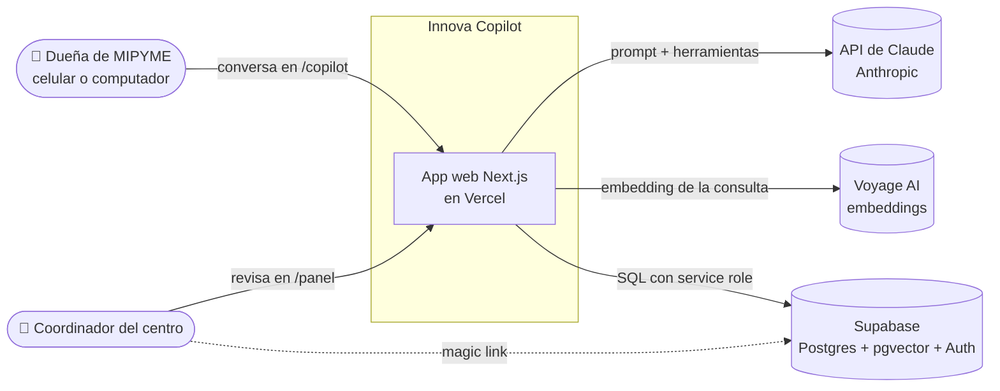
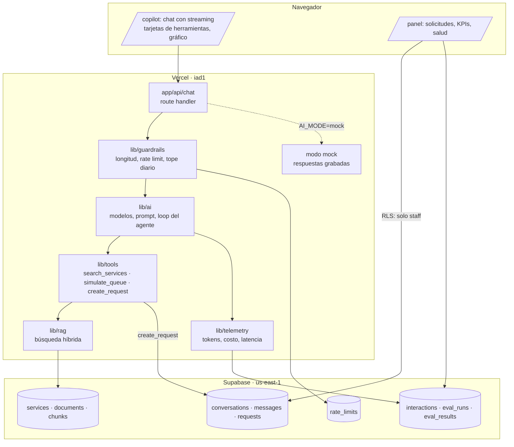
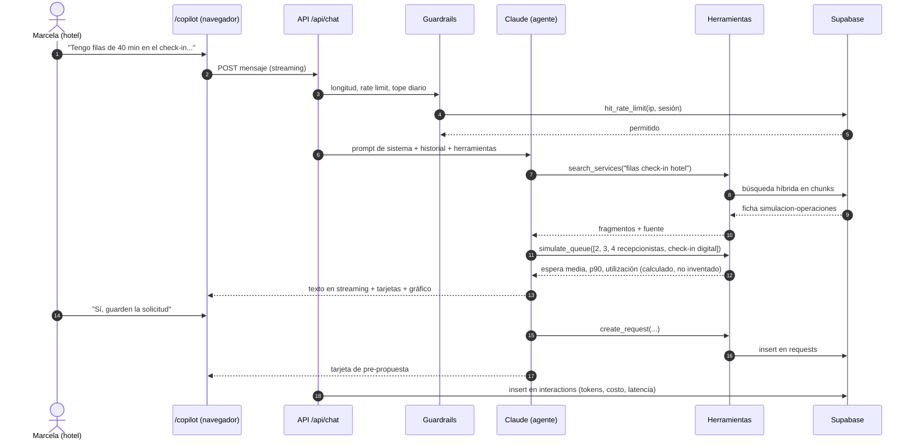

# Arquitectura

> Este documento se actualiza a medida que avanzan los pasos. Los componentes marcados como *(paso XX)* todavía no existen en ese punto del historial.

## 1. Contexto: quién usa el sistema y con qué habla

## 2. Componentes

| Componente | Paso en que aparece |
|---|---|
| Landing, esquema de datos, seed, despliegue | 02 |
| Chat con streaming, un solo prompt, "Bajo el capó" | 03 |
| Evals | 04 |
| RAG híbrido (`lib/rag`, `match_chunks`) | 05 |
| Herramientas, loop del agente, guardrails, rate limit, modo mock | 06 |
| Clasificador clásico (`ml/`) | 07 |
| Panel con login, tests e2e, CI completo | 08 |
| Telemetría en el panel, drift, runbook | 09 |

## 3. Secuencia de una conversación con herramientas (caso del hotel)

## 4. Compensaciones (trade-offs) aterrizadas al proyecto

Estas son las compensaciones que el mapa de habilidades destaca en el pilar 2. Ninguna decisión es "la mejor" en abstracto: cada una gana algo y paga algo.

| Atributo | Qué significa aquí | Qué decidimos | Qué pagamos |
|---|---|---|---|
| **Latencia** | Tiempo hasta ver la respuesta | Streaming (se ve el texto mientras se genera); Vercel `iad1` junto a Supabase `us-east-1`; modelo pequeño (Haiku) para clasificar y evaluar | Los usuarios en Colombia están lejos de `iad1` (~decenas de ms de red, pequeño frente a los segundos del LLM) |
| **Disponibilidad** | Que la app responda aunque falle algo | `AI_MODE=mock` si la API del LLM falla; búsqueda por texto completo si Voyage falla | El modo mock solo cubre el caso del hotel |
| **Consistencia** | Que todos vean los mismos datos | Una sola base de datos (Postgres) para todo; transacciones para el rate limit | Nada relevante a esta escala |
| **Fiabilidad** | Que haga lo correcto una y otra vez | El LLM no calcula: `simulate_queue` es determinista y con tests; evals en cada cambio; validación zod de las herramientas | Más código que "pedirle todo al modelo" |
| **Mantenibilidad** | Que otro pueda cambiarlo sin romperlo | Un solo repo y lenguaje; ADRs; IDs de modelo en un solo archivo; cada paso documentado | Documentar toma tiempo |
| **Simplicidad** | Menos piezas móviles | Sin base vectorial aparte, sin colas, sin microservicios, sin grafo de conocimiento | Si el sistema creciera mucho, habría que separar piezas |
| **Costo** | Dinero por conversación y fijo al mes | Planes gratuitos (Vercel Hobby, Supabase Free); Haiku para tareas simples; prompt caching; rate limit y tope diario | Límites de los planes gratuitos (pausa por inactividad, cuotas) |

## 5. Seguridad (resumen)

- **RLS en todas las tablas.** El rol `anon` (la clave pública) no puede leer ni escribir nada: se verificó en el paso 02 con `curl` (respuesta `42501 permission denied`).
- El servidor usa la **service role** solo en código de servidor (`lib/supabase/admin.ts`).
- El personal del centro lee a través de políticas RLS que verifican su correo contra una allowlist en un esquema privado (`private.is_staff()`).
- Las funciones de rate limit y de allowlist solo las puede ejecutar la service role.
- Secretos: `.env.local` (ignorado por git), variables de Vercel marcadas como *sensitive*, hook anti-secretos y gitleaks en CI.
