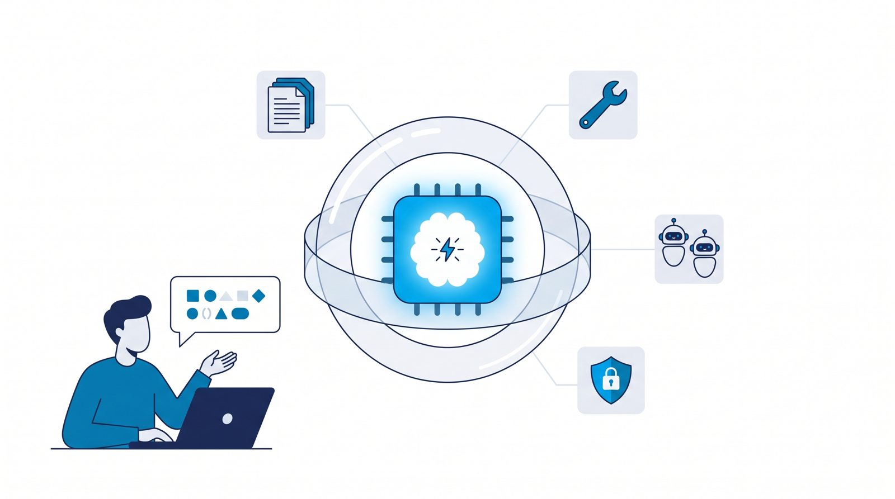

# Ilustraciones generadas con IA (Gemini)

Algunas imágenes de la documentación y de los slides son **ilustraciones conceptuales generadas con IA**. Este documento explica cuáles son, cómo se hicieron y, sobre todo, **qué reglas seguimos para no confundir una ilustración con evidencia**.

## La regla más importante

| ✅ Sí se genera con IA | ❌ Nunca se genera con IA |
|---|---|
| Ilustraciones de conceptos (el "harness" que envuelve al LLM, "el LLM no calcula") | **Gráficos con datos** (evals, simulación del hotel, ML vs. LLM): salen de matplotlib con los archivos de resultados |
| Escenas y personajes **ficticios** (el hotel, las personas simuladas) | **Capturas de pantalla** de la app: salen de Playwright contra la app real |
| | Diagramas de arquitectura: son Mermaid, versionados como texto |

Una imagen generada que *parezca* un gráfico o una captura sería una forma de inventar evidencia. Es la misma regla de honestidad del proyecto: **nunca inventes métricas**.

Además, cada ilustración se marca con **"Ilustración generada con IA"** donde se usa. Las imágenes de Gemini incluyen una marca de agua invisible **SynthID** (según la documentación de Google).

## Las ilustraciones

| Imagen | Prompt | Dónde se usa |
|---|---|---|
|  | [harness-agente.md](img/prompts/harness-agente.md) | [Agentes de código](03-agentes-de-codigo.md), slides |
|  | [hotel-getsemani.md](img/prompts/hotel-getsemani.md) | [Usuarios](00-dar-forma/usuarios.md), slides |
|  | [llm-no-calcula.md](img/prompts/llm-no-calcula.md) | [Paso 06](pasos/paso-06-agente.md), slides |
|  | [personas.md](img/prompts/personas.md) | [Usuarios](00-dar-forma/usuarios.md) |

## Cómo se hizo, paso a paso

### 1. Elegir el modelo verificando, no recordando

Listamos los modelos disponibles con la clave (`GET /v1beta/models`) y leímos la guía oficial de generación de imágenes. Elegimos **`gemini-3.1-flash-image`** (versátil, de 0,5K a 4K). Otros disponibles: `gemini-3.1-flash-lite-image` (más rápido, solo 1K) y `gemini-3-pro-image` (tareas complejas).

### 2. Probar una sola imagen antes de escribir el script

La guía mostraba un campo de respuesta (`output_image`) que **no apareció** en la respuesta real. Con una prueba pequeña vimos que la imagen llega en `steps[].content[]` como un bloque `{"type": "image", "data": "<base64>"}`. *Lección: con APIs nuevas, una prueba mínima ahorra una hora de depuración.*

```bash
curl -s -X POST "https://generativelanguage.googleapis.com/v1beta/interactions" \
  -H "x-goog-api-key: $GEMINI_API_KEY" -H "Content-Type: application/json" \
  -d '{
    "model": "gemini-3.1-flash-image",
    "input": [{"type": "text", "text": "A simple flat illustration of a blue paper boat"}],
    "response_format": {"type": "image", "mime_type": "image/jpeg", "aspect_ratio": "16:9", "image_size": "1K"}
  }'
```

### 3. Versionar los prompts como archivos

Cada prompt es un Markdown en [`docs/img/prompts/`](img/prompts/), con un encabezado YAML (archivo de salida, proporción, tamaño y dónde se usa). Así cualquiera puede ver **exactamente** qué se pidió, cambiarlo y regenerar.

Técnicas de prompt que usamos:
- **Estilo explícito:** "editorial flat vector illustration", "white background, plenty of white space".
- **Paleta cerrada** con los códigos de color de la presentación (`#1A2850`, `#0283BA`, `#01A2E9`, `#E6EAF0`), para que las ilustraciones se vean parte del mismo diseño.
- **Prohibiciones claras:** "No text, no letters, no logos", y "fictional characters, not real people".

### 4. Generar

```bash
pnpm tsx scripts/generate-illustrations.ts            # todas
pnpm tsx scripts/generate-illustrations.ts personas   # solo una
```

El script ([`scripts/generate-illustrations.ts`](../scripts/generate-illustrations.ts)) lee cada prompt, llama a la API, guarda el JPG y registra el uso de tokens en [`generacion.json`](img/ilustraciones/generacion.json). No convertimos esos tokens a dólares porque no verificamos la tarifa de imágenes; el uso real está en la consola de Google AI Studio.

### 5. Revisar a mano y reducir

- **Revisión visual de cada imagen.** El modelo **no siempre obedece**: en la del hotel escribió "RECEPCIÓN" en un letrero, aunque el prompt decía "no text". Lo aceptamos porque la palabra es correcta y no confunde, pero es un buen recordatorio de que hay que mirar el resultado.
- **Tamaño:** las imágenes originales pesaban entre 1,5 y 3,5 MB. Las reducimos a 1.600 px de ancho (entre 47 y 324 KB) para no inflar el repositorio.

## Reprodúcelo tú (ejercicio)

1. Consigue una clave en https://aistudio.google.com y ponla en `.env.local` como `GEMINI_API_KEY`.
2. Crea `docs/img/prompts/mi-ilustracion.md` con el mismo formato y describe un concepto de tu proyecto.
3. Corre `pnpm tsx scripts/generate-illustrations.ts mi-ilustracion`.
4. Pregúntate: ¿alguien podría confundir esta imagen con un dato o una captura real? Si la respuesta es sí, no la uses.
