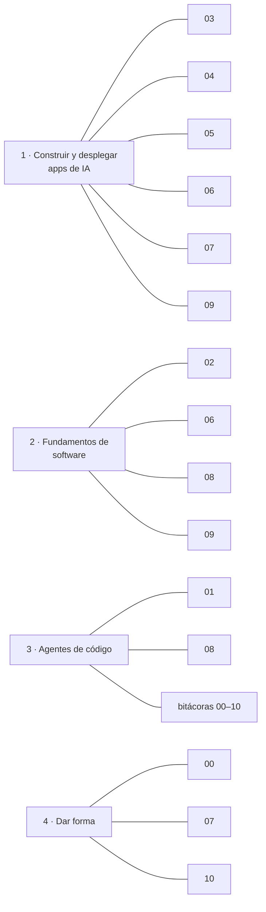

# Mapa de habilidades → evidencia en el repo

Cada competencia del **AI Engineering Skills Map** (serie de Andrew Ng en *The Batch*, DeepLearning.AI, 2026), el paso del proyecto donde se aplica y el archivo donde se puede ver. **Ninguna competencia queda sin evidencia.**

Serie original:
[Parte 1: el mapa](https://www.deeplearning.ai/the-batch/the-ai-engineering-skills-map) ·
[Parte 2: construir y desplegar aplicaciones de IA](https://www.deeplearning.ai/the-batch/he-ai-engineering-skills-map-in-detail-building-and-deploying-ai-applications) ·
[Parte 3: fundamentos de ingeniería de software](https://www.deeplearning.ai/the-batch/the-ai-engineering-skills-map-in-detail-software-engineering-fundamentals) ·
[Parte 4: uso de agentes de código](https://www.deeplearning.ai/the-batch/the-ai-engineering-skills-map-in-detail-using-coding-agents) ·
[Parte 5: dar forma a lo que se construye](https://www.deeplearning.ai/the-batch/the-ai-engineering-skills-map-in-detail-shaping-the-build)

## Pilar 1 · Construir y desplegar aplicaciones de IA

| Competencia | Paso | Evidencia |
|---|---|---|
| **Fundamentos de LLM** | 03 | Tokens, ventana de contexto, `temperature` → `effort`, knowledge cutoff y caché medidos: [paso-03](pasos/paso-03-primer-llm.md), [experimento de caché](evidencia/paso-03/experimento-cache-latencia.json), [`lib/ai/models.ts`](../lib/ai/models.ts) |
| **Fundamentar con datos** | 05 | RAG híbrido con citas: [paso-05](pasos/paso-05-rag.md), [`match_chunks`](../supabase/migrations/20260929170000_match_chunks.sql), [`lib/rag/`](../lib/rag/), [eval del recuperador](evidencia/paso-05/retrieval-eval.json) |
| **Sistemas agénticos** | 06 | Herramientas, loop con máximo de pasos, aprobación humana: [paso-06](pasos/paso-06-agente.md), [`lib/tools/`](../lib/tools/), [`lib/ai/copilot.ts`](../lib/ai/copilot.ts) |
| **Desarrollo guiado por evals** | 04 → 06 | Dataset, chequeos deterministas, juez, humano en el ciclo, análisis de errores: [paso-04](pasos/paso-04-evals.md), [`evals/`](../evals/), [análisis de errores](analisis-de-errores.md), [comparación](../evals/results/comparacion.json) |
| **Operación en producción** | 03, 09 | Telemetría por turno, salud (costo, p50/p95, errores), drift, runbook: [paso-09](pasos/paso-09-produccion.md), [`lib/telemetry/`](../lib/telemetry/), [runbook](runbook.md) |
| **Fundamentos de ML** | 07 | TF-IDF + regresión logística, split estratificado, sesgo/varianza, comparación con el LLM: [paso-07](pasos/paso-07-ml-clasico.md), [notebook](../ml/clasificador.ipynb) |

## Pilar 2 · Fundamentos de ingeniería de software

| Competencia | Paso | Evidencia |
|---|---|---|
| **Aplicaciones full-stack** | 02, 06, 08 | Next.js (UI + API), streaming, panel con login: [`app/`](../app/), [`components/`](../components/), [paso-02](pasos/paso-02-arquitectura-datos.md) |
| **Gestión de datos** | 02, 05 | Esquema, migraciones versionadas, seed, ingesta con checksums: [`supabase/migrations/`](../supabase/migrations/), [`scripts/seed.ts`](../scripts/seed.ts), [`scripts/ingest.ts`](../scripts/ingest.ts) |
| **Arquitectura de sistemas** | 02 | Diagramas de contexto, componentes y secuencia; compensaciones aterrizadas; ADRs: [arquitectura](arquitectura.md), [ADRs](adr/) |
| **Seguridad y fiabilidad** | 02, 06, 08 | RLS en todas las tablas (probado con la clave pública), guardrails, rate limit probado, aprobación humana, auditoría: [paso-06](pasos/paso-06-agente.md#guardrails-probados-no-solo-escritos), [revisión agéntica](revision-agentica.md) |
| **Escala y operación en producción** | 09 | Despliegue continuo, rollback, topes de costo, fallo cerrado, plan B: [runbook](runbook.md), [paso-09](pasos/paso-09-produccion.md) |

## Pilar 3 · Uso de agentes de código

| Competencia | Paso | Evidencia |
|---|---|---|
| **Dirigir el flujo** | 00–10 | Spec aprobada antes de construir, 3 puntos de control humanos, recorte de alcance decidido por el humano: [bitácoras](bitacora/), [paso-00](pasos/paso-00-dar-forma.md) |
| **Habilitar autonomía** | 01 | Permisos allow/deny y hooks: [`.claude/settings.json`](../.claude/settings.json), [hooks](../.claude/hooks/), [agentes de código](03-agentes-de-codigo.md) |
| **Revisar el trabajo** | 01, 08 | Hook de lint, tests, evals, subagente revisor, CI con gitleaks, revisión agéntica: [revisión agéntica](revision-agentica.md), [`.github/workflows/ci.yml`](../.github/workflows/ci.yml) |
| **Personalizar el agente y su entorno** | 01 | `CLAUDE.md`, skills `/eval` `/nuevo-paso` `/revisar`, subagente: [`CLAUDE.md`](../CLAUDE.md), [`.claude/`](../.claude/) |
| **Fundamentos del agente de código** | 01 | Cómo el harness envuelve al LLM (contexto, herramientas, subagentes): [agentes de código](03-agentes-de-codigo.md) |

## Pilar 4 · Dar forma a lo que se construye

| Competencia | Paso | Evidencia |
|---|---|---|
| **Conducir el ciclo de construcción** | 00, 04 | Prototipo vs. MVP vs. sistema empresarial; ciclo construir → medir → analizar → decidir: [decisión](00-dar-forma/decision-construir.md), [análisis de errores](analisis-de-errores.md) |
| **Tomar decisiones de producto** | 00, 05, 07 | Spec, métricas, decisiones con datos (híbrido vs. FTS, clasificador): [spec](00-dar-forma/spec-mvp.md), [métricas](00-dar-forma/metricas.md), [ADR 0005](adr/0005-clasificador.md) |
| **Comunicar y liderar** | 10 | Memo para la dirección, slides y notas del presentador: [memo](memo-stakeholders.md), [guion](guion-charla.md), [`presentacion/`](../presentacion/) |
| **Propiedad con alta agencia** | 10 | Retrospectiva honesta, roadmap, errores documentados sin esconderlos: [retrospectiva](retrospectiva.md), [roadmap v2](roadmap-v2.md) |

## Base común

| Competencia | Evidencia |
|---|---|
| **Aprendizaje continuo** | En cada paso se verificó contra la documentación **vigente** en lugar de la memoria del agente, y cada cambio de API quedó registrado: AI SDK v7 (`instructions`, `responseMessages`, `toolApproval`), `temperature` eliminada en Sonnet 5.5 y en el SDK de Python 1.x, Next.js 16 (`proxy.ts`, `AGENTS.md`), Supabase SSR (`getClaims`), Gemini `interactions`. Ver [retrospectiva](retrospectiva.md) y las bitácoras. |
