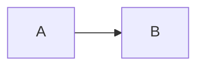

# Paso XX — <Título>

**Pilar(es) del mapa:** <1 Construir y desplegar apps de IA | 2 Fundamentos de software | 3 Agentes de código | 4 Dar forma>
**Competencias:** <nombres exactos de las competencias del mapa>

## Objetivo

## La idea clave

<Un párrafo o dos, en prosa: qué vale la pena entender de este paso y dónde mirarlo.>

## Qué construimos

## Decisiones y compensaciones (trade-offs)

## Diagrama



## Cómo verlo

```bash
git checkout paso-XX-nombre
# comandos exactos y la salida esperada
```

## Para pensar

1.
2.
3.

## Pruébalo tú

## Qué aprendimos / qué cambiaría
