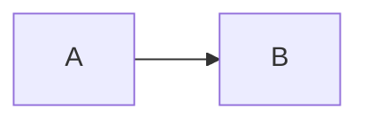

# Paso XX — <Título>

**Pilar(es) del mapa:** <1 Construir y desplegar apps de IA | 2 Fundamentos de software | 3 Agentes de código | 4 Dar forma>
**Competencias:** <nombres exactos de las competencias del mapa>

## Objetivo

## Qué construimos

## Decisiones y compensaciones (trade-offs)

## Diagrama



## Cómo verlo

```bash
git checkout paso-XX-nombre
# comandos exactos y la salida esperada
```

## Qué mostrar en la charla (guion de 2–3 min)

## Para discutir con el público

1.
2.
3.

## Reprodúcelo tú (ejercicio)

## Qué aprendimos / qué cambiaría
