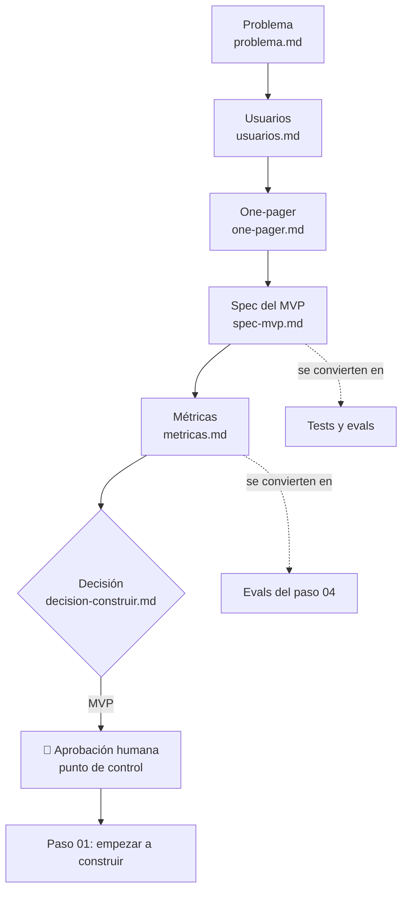

# Paso 00 — Dar forma: qué construir y por qué

**Pilar(es) del mapa:** 4 Dar forma a lo que se construye
**Competencias:** Conducir el ciclo de construcción · Tomar decisiones de producto

## Objetivo

Decidir **qué** vamos a construir, **para quién** y **cómo sabremos si funciona**, antes de escribir una sola línea de código. Con un agente de código, escribir código es barato. Lo caro es construir lo equivocado.

## La idea clave

Antes de pedirle código a nadie, sea persona o agente, conviene poder responder tres preguntas: qué problema resolvemos, para quién y cómo sabremos si funciona.

El corazón de este paso es la tabla **"Por qué no solo IA"** de [problema.md](../00-dar-forma/problema.md). El LLM es bueno entendiendo un problema contado con palabras de la calle y redactando una propuesta. Pero los precios tienen que salir del catálogo, los cálculos de una herramienta, y la decisión final es de una persona. Casi todo lo que viene después (RAG, herramientas, aprobación humana) es la consecuencia de esa tabla.

Fíjate también en [metricas.md](../00-dar-forma/metricas.md): los objetivos se fijan **antes** de construir. Así, cada paso posterior tiene contra qué compararse.

## Qué construimos

Solo documentos, en [`docs/00-dar-forma/`](../00-dar-forma/):

| Archivo | Pregunta que responde |
|---|---|
| [problema.md](../00-dar-forma/problema.md) | ¿Qué problema resolvemos? ¿Por qué IA y por qué **no solo** IA? |
| [usuarios.md](../00-dar-forma/usuarios.md) | ¿Para quién? (2 personas + entrevistas **simuladas**) |
| [one-pager.md](../00-dar-forma/one-pager.md) | ¿Cuál es la propuesta de valor, qué entra, qué no y qué riesgos hay? |
| [spec-mvp.md](../00-dar-forma/spec-mvp.md) | ¿Qué debe hacer exactamente? Requisitos, historias, criterios de aceptación |
| [metricas.md](../00-dar-forma/metricas.md) | ¿Cómo sabremos si funciona? Métrica norte, evals, costo, latencia |
| [decision-construir.md](../00-dar-forma/decision-construir.md) | ¿Prototipo, MVP o sistema empresarial? |

## Decisiones y compensaciones (trade-offs)

| Decisión | Alternativa descartada | Por qué |
|---|---|---|
| MVP con sesgo a la acción | Prototipo / sistema empresarial | Ver [decision-construir.md](../00-dar-forma/decision-construir.md) |
| El LLM no calcula; usa herramientas deterministas | Pedirle al LLM que estime tiempos de espera | Los números inventados destruyen la confianza |
| Pre-propuesta revisada por un humano | Venta automática | La decisión comercial es del centro |
| Entrevistas simuladas, marcadas como tales | Omitir el paso de usuarios | Enseñar la técnica sin fingir que hubo entrevistas reales |
| Métricas como **objetivos** explícitos | "Ya veremos" | Sin objetivo no hay forma de decidir si mejoramos |

## Diagrama



## Cómo verlo

```bash
git clone https://github.com/FutureTales/ai-engineering-demo.git
cd ai-engineering-demo
git checkout paso-00-dar-forma
ls docs/00-dar-forma/
# problema.md  usuarios.md  one-pager.md  spec-mvp.md  metricas.md  decision-construir.md
```

En este paso no hay código ni app: el repositorio solo tiene documentos. Puedes leerlos directamente en GitHub.

## Para pensar

1. Si le pidieras al LLM que calcule directamente el tiempo de espera del hotel, ¿cómo te darías cuenta de que se equivocó?
2. De las decisiones de este paso, ¿cuál sería más difícil de revertir más adelante?
3. Las entrevistas son simuladas. ¿Qué supuesto te preocuparía más si tuvieras que validarlo con MIPYMES reales?

## Pruébalo tú

Elige un problema de una organización que conozcas (tu universidad, un negocio familiar) y escribe, **sin código**:

1. El problema en una frase.
2. Una tabla "¿LLM solo? / Qué usamos" con al menos 3 tareas.
3. Una métrica norte y dos métricas de calidad con un objetivo numérico.

Si usas un agente de código, pídele un borrador y **revísalo tú**: ¿inventó datos? ¿las métricas son medibles?

## Qué aprendimos / qué cambiaría

- Escribir la spec primero hizo evidente qué medir en el paso 04: cada requisito no funcional ya tiene su eval.
- En un proyecto real, las entrevistas **deben ser reales**. Aquí están simuladas y marcadas para que nadie las confunda con evidencia.
- Lo que cambiaría: validar el rango de precios del catálogo con el centro antes de construir (aquí es ficticio).
