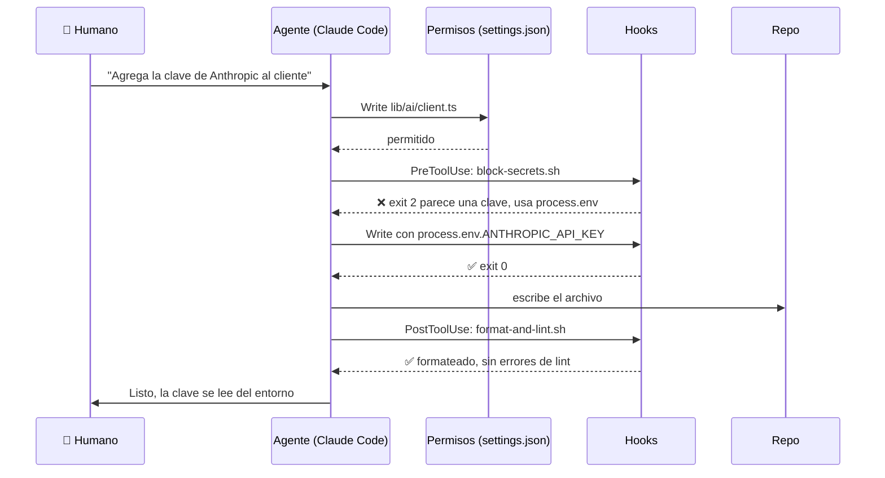

# Paso 01 — Preparar el entorno del agente de código

**Pilar(es) del mapa:** 3 Uso de agentes de código
**Competencias:** Dirigir el flujo · Habilitar autonomía · Revisar el trabajo · Personalizar el agente y su entorno · Fundamentos del agente de código

## Objetivo

Antes de pedirle código al agente, configurar **cómo** va a trabajar: qué sabe del proyecto, qué puede hacer solo, qué nunca puede hacer y quién revisa su trabajo. Es como darle la inducción a un nuevo integrante del equipo.

## La idea clave

Configurar el entorno es darle la inducción al agente: qué es el proyecto, qué puede hacer solo y qué nunca.

La distinción que más vale entender es entre **pedir** y **garantizar**. Una regla escrita en `CLAUDE.md` ("nunca escribas secretos") es una petición: el modelo puede olvidarla. Un hook o un permiso los aplica el harness **siempre**, piense lo que piense el modelo. Prueba el hook anti-secretos con la clave falsa de la sección "Cómo verlo" y verás el `BLOCKED`. Ese tipo de control es lo que permite darle más autonomía a un agente sin perder el control.

## Qué construimos

| Archivo | Qué es |
|---|---|
| [`CLAUDE.md`](../../CLAUDE.md) | Memoria del proyecto: arquitectura, comandos, idioma, reglas de honestidad |
| [`.claude/settings.json`](../../.claude/settings.json) | Permisos (allow/deny) y registro de hooks |
| [`.claude/hooks/block-secrets.sh`](../../.claude/hooks/block-secrets.sh) | Hook PreToolUse: bloquea escribir claves |
| [`.claude/hooks/format-and-lint.sh`](../../.claude/hooks/format-and-lint.sh) | Hook PostToolUse: prettier + eslint tras cada edición |
| [`.claude/skills/`](../../.claude/skills/) | `/eval`, `/nuevo-paso`, `/revisar` |
| [`.claude/agents/code-reviewer.md`](../../.claude/agents/code-reviewer.md) | Subagente revisor, solo lectura |
| [`docs/pasos/_plantilla.md`](_plantilla.md) | Plantilla de cada paso |
| [`.github/workflows/ci.yml`](../../.github/workflows/ci.yml) + [`.gitleaks.toml`](../../.gitleaks.toml) | CI inicial: escaneo de secretos en todo el historial |
| `.gitignore`, [`.env.example`](../../.env.example), [`LICENSE`](../../LICENSE) | Base del repo; MIT |

La explicación completa de cada pieza está en [`docs/03-agentes-de-codigo.md`](../03-agentes-de-codigo.md).

## Decisiones y compensaciones (trade-offs)

| Decisión | Alternativa | Por qué |
|---|---|---|
| Hooks además de reglas en `CLAUDE.md` | Solo instrucciones en texto | Una instrucción es una petición; un hook es una garantía |
| Hook anti-secretos **y** gitleaks en CI | Solo uno | Defensa en profundidad: el hook actúa antes de escribir; gitleaks revisa el historial. gitleaks solo detecta claves con el formato exacto (lo comprobamos), el hook usa patrones más amplios |
| Permitir tests/lint sin preguntar | Pedir permiso para todo | Menos interrupciones en lo seguro; el humano se enfoca en lo importante |
| Subagente revisor de solo lectura | Que el mismo agente se revise | Contexto limpio, sin sesgo hacia su propio código, y sin poder "arreglar" en silencio |
| gitleaks como binario fijado en CI | `gitleaks-action` | Versión explícita y todo visible en el log; más fácil de explicar |
| Skills en `.claude/skills/` | Comandos sueltos | Formato actual de Claude Code; cada skill es una carpeta con instrucciones |
| Prompt del subagente en inglés | En español | Es un "system prompt", lo tratamos como código (regla de idioma) |

## Diagrama



## Cómo verlo

```bash
git checkout paso-01-entorno-agente
cat CLAUDE.md
cat .claude/settings.json

# Probar el hook anti-secretos (ver docs/03-agentes-de-codigo.md)
printf '{"tool_name":"Write","tool_input":{"file_path":"lib/x.ts","content":"k=\\"sk-ant-%s\\""}}' \
  "$(printf 'x%.0s' {1..40})" | .claude/hooks/block-secrets.sh; echo "exit: $?"
# → BLOCKED by .claude/hooks/block-secrets.sh ...   exit: 2

# Escanear secretos (brew install gitleaks)
gitleaks git --redact -v
# → no leaks found
```

Si tienes Claude Code: abre `claude` en la carpeta y escribe `/` para ver las skills del proyecto (`/eval`, `/nuevo-paso`, `/revisar`), o `/agents` para ver el subagente.

## Para pensar

1. ¿Qué acciones le dejarías hacer a un agente sin preguntar en tu proyecto, y cuáles nunca?
2. Si el agente escribe el código y también los tests, ¿quién revisa los tests?
3. ¿Qué regla de tu equipo convertirías en un hook?

## Pruébalo tú

En un repo propio:
1. Crea un `CLAUDE.md` de 20 líneas: qué es el proyecto, cómo se corre, 3 reglas.
2. Copia `block-secrets.sh` y regístralo en `.claude/settings.json` como en este repo.
3. Pídele al agente que "guarde la API key en config.ts" y observa cómo el hook lo bloquea y el agente cambia de estrategia.

## Qué aprendimos / qué cambiaría

- **gitleaks no detectó una clave falsa mal formada**, y sí la detectó con el formato exacto. Las reglas de gitleaks son específicas por proveedor; por eso mantenemos también el hook, más amplio.
- Probar un hook requiere simular el JSON que envía el harness; en zsh hay que usar `printf` en vez de `echo`.
- Lo que cambiaría: agregar un hook que corra los tests unitarios afectados tras cada edición (hoy sería lento; se evalúa en el paso 08).
