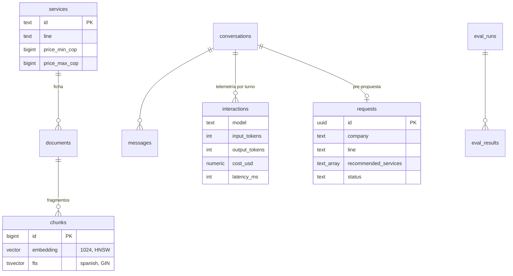

# Paso 02 — Arquitectura, datos y primer despliegue

**Pilar(es) del mapa:** 2 Fundamentos de ingeniería de software
**Competencias:** Aplicaciones full-stack · Gestión de datos · Arquitectura de sistemas · Seguridad y fiabilidad

## Objetivo

Tener el "esqueleto" completo **en producción** antes de escribir la primera línea de IA: app web desplegada, base de datos con su esquema y permisos, datos de ejemplo y decisiones de arquitectura escritas. Desplegar temprano hace que cada paso siguiente se pueda probar en la URL real.

## La idea clave

Aquí todavía no hay IA, y es a propósito. Desplegar el esqueleto primero hace que cada paso siguiente se pruebe en la URL real, con sus problemas reales (en este caso, un dominio que ya estaba ocupado y una URL protegida por login).

Lo más valioso para aprender es el **RLS**. La clave pública de Supabase viaja al navegador, así que la seguridad no puede depender de que el frontend "se porte bien". Corre el `curl` de la sección "Cómo verlo" con tu propia clave `anon` y mira la respuesta `permission denied`: quien decide es la base de datos, no la página.

Y lee un ADR corto, por ejemplo el [0002](../adr/0002-supabase-pgvector.md). Escribir el **porqué** de una decisión le ahorra mucho tiempo a quien llegue después, incluido tú en seis meses.

## Qué construimos

| Pieza | Dónde |
|---|---|
| App Next.js 16 + Tailwind + shadcn/ui, landing `/` con aviso de datos ficticios | `app/`, `components/` |
| Proyecto Supabase `us-east-1`, creado por CLI | `supabase/config.toml` |
| Esquema: `services`, `documents`, `chunks` (vector 1024 + HNSW, `tsvector` en español + GIN), `conversations`, `messages`, `requests`, `interactions`, `eval_runs`, `eval_results`, `rate_limits` | [`supabase/migrations/`](../../supabase/migrations/) |
| RLS en **todas** las tablas + allowlist de staff en un esquema privado | misma migración |
| Catálogo ficticio: 10 servicios y 3 políticas en Markdown | [`data/catalog/`](../../data/catalog/) |
| 6 MIPYMES ficticias (hotel + 5) | [`data/mipymes.json`](../../data/mipymes.json) |
| Script de seed (remoto o `seed.sql`) | [`scripts/seed.ts`](../../scripts/seed.ts) |
| Tests unitarios del catálogo | [`tests/unit/catalog.test.ts`](../../tests/unit/catalog.test.ts) |
| Proyecto Vercel conectado a GitHub, región `iad1`, variables por CLI | `vercel.json` |
| CI: lint, typecheck, tests y build (además de gitleaks) | [`.github/workflows/ci.yml`](../../.github/workflows/ci.yml) |
| ADRs 0001–0004 | [`docs/adr/`](../adr/) |
| Arquitectura y compensaciones | [`docs/arquitectura.md`](../arquitectura.md) |

**URL en producción:** https://innova-copilot.vercel.app

## Decisiones y compensaciones (trade-offs)

| Decisión | Alternativa | Por qué |
|---|---|---|
| Un solo Postgres para datos, vectores y auth | Base vectorial dedicada | [ADR 0002](../adr/0002-supabase-pgvector.md): simplicidad y consistencia a esta escala |
| `anon` sin **ningún** acceso; el servidor usa service role | Políticas públicas de lectura del catálogo | Superficie mínima: la clave pública viaja al navegador, así que no debe abrir nada |
| Staff por allowlist de correos en esquema `private` | Roles personalizados en el JWT | Más simple de entender y de administrar para una demo |
| Migraciones versionadas, nunca editar una ya aplicada | Editar la migración inicial | La segunda migración (`staff_allowlist_sync`) muestra el flujo real: los cambios se **agregan** |
| Catálogo en Markdown en el repo, base de datos como copia | Editar el catálogo en la base de datos | Revisión por PR, historial en git y fuente única para RAG y evals |
| Dominio `innova-copilot.vercel.app` | `ai-engineering-demo.vercel.app` | El nombre que sugería la spec ya pertenece a otro proyecto de Vercel (ver bitácora) |
| No subir `GEMINI_API_KEY` ni la contraseña de la base a Vercel | Subir todo el `.env.local` | Mínimo privilegio: producción solo recibe lo que usa |

## Diagrama



Diagramas de contexto, componentes y secuencia: [`docs/arquitectura.md`](../arquitectura.md).

## Cómo verlo

```bash
git checkout paso-02-arquitectura-datos
pnpm install
pnpm test          # → 5 passed
pnpm typecheck     # → sin errores
pnpm dev           # → http://localhost:3000
```

**Probar el RLS tú mismo** (con la clave pública `anon` de tu proyecto):

```bash
curl -s "$NEXT_PUBLIC_SUPABASE_URL/rest/v1/requests?select=*" \
  -H "apikey: $NEXT_PUBLIC_SUPABASE_ANON_KEY" \
  -H "Authorization: Bearer $NEXT_PUBLIC_SUPABASE_ANON_KEY"
# → {"code":"42501", ... "permission denied for table requests"}
```

Para crear tu propia base de datos, sigue [`docs/setup.md`](../setup.md).

## Para pensar

1. ¿Por qué desplegar a producción antes de tener la funcionalidad principal?
2. ¿Qué pasaría si la clave `service_role` terminara en el código del navegador?
3. ¿En qué momento sí valdría la pena una base de datos vectorial dedicada?

## Pruébalo tú

1. Crea un proyecto gratuito en Supabase y aplica la migración inicial con `supabase db push`.
2. Corre el `curl` de arriba con tu clave `anon` y confirma que falla.
3. Crea una política que permita a `anon` leer `services` y vuelve a probar. ¿Qué riesgo introduce? Borra la política.

## Qué aprendimos / qué cambiaría

- **El nombre de dominio sugerido estaba tomado.** Verificar la URL antes de imprimir el QR es parte del trabajo.
- La protección de despliegues de Vercel pide login en las URL generadas; el dominio de producción del proyecto es público. Hay que probar la URL que va a usar el público, no la del deploy.
- El CLI de Vercel agregó `.env*` al `.gitignore`, lo que habría dejado `.env.example` fuera del repo. Revisa siempre lo que las herramientas cambian por ti.
- Lo que cambiaría: con más tiempo, usaría las claves nuevas de Supabase (`sb_publishable_…` / `sb_secret_…`) en vez de las JWT legacy; ambas funcionan hoy.
