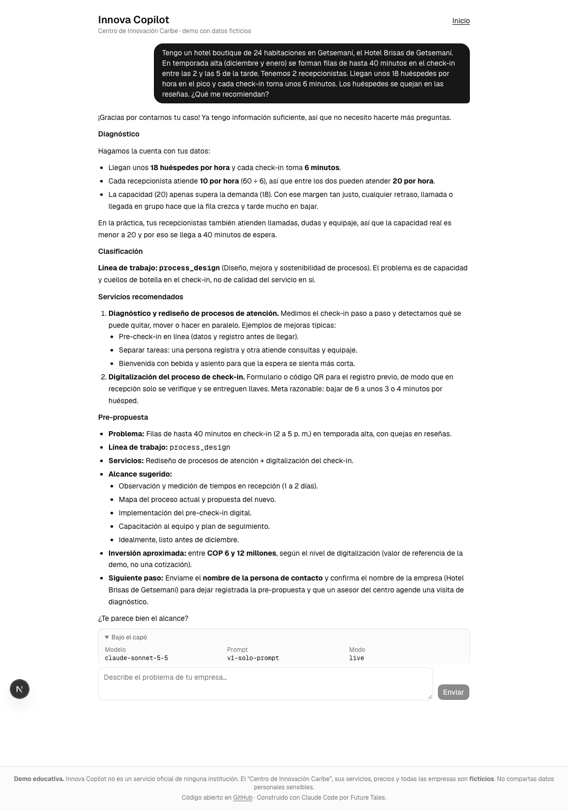
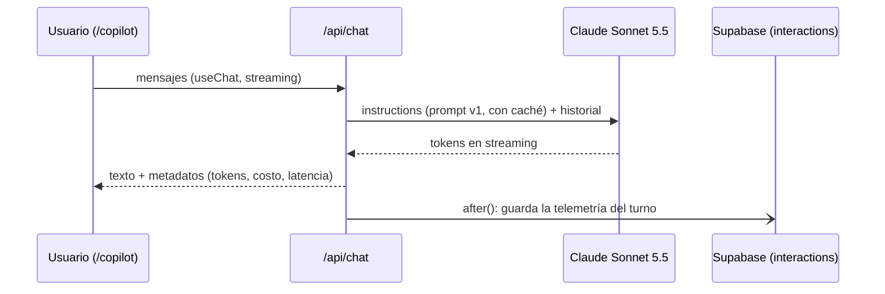

# Paso 03 — El primer LLM: un chat con un solo prompt

**Pilar(es) del mapa:** 1 Construir y desplegar aplicaciones de IA
**Competencias:** Fundamentos de LLM

## Objetivo

Poner un modelo de lenguaje a conversar con la MIPYME, con **un solo prompt de sistema**, sin herramientas ni datos del catálogo. Queremos entender los fundamentos (tokens, contexto, costo, latencia, caché) y **ver a propósito dónde falla** un LLM cuando no tiene datos.

## La idea clave

Un modelo de lenguaje no miente a propósito: completa el patrón más probable. Si no tiene los datos del catálogo, lo más probable es un precio que **suena** razonable.

La respuesta del hotel lo muestra bien. Es convincente, hace correctamente la cuenta de ocupación (90 %) y aun así propone "COP 6 a 12 millones", cuando la ficha real dice 8 a 25. Y no lo hace siempre: en el caso de la marca se negó a inventar cifras. Por eso probar a mano tres casos no alcanza para saber **con qué frecuencia** falla. Esa pregunta la responde el paso 04.

Mientras tanto, abre **"Bajo el capó"** en `/copilot`. Ver los tokens, el caché y el costo de cada respuesta hace concretos conceptos que suelen quedarse en teoría.

## Qué construimos

| Pieza | Dónde |
|---|---|
| Chat con streaming en `/copilot` | [`app/copilot/page.tsx`](../../app/copilot/page.tsx), [`components/chat/chat.tsx`](../../components/chat/chat.tsx) |
| Endpoint `/api/chat` con el AI SDK v7 | [`app/api/chat/route.ts`](../../app/api/chat/route.ts) |
| Prompt de sistema versionado (`v1-solo-prompt`) | [`lib/ai/prompts.ts`](../../lib/ai/prompts.ts) |
| IDs de modelo y precios en un solo archivo | [`lib/ai/models.ts`](../../lib/ai/models.ts) |
| Panel **"Bajo el capó"**: modelo, tokens, caché, costo, latencia | [`components/chat/under-the-hood.tsx`](../../components/chat/under-the-hood.tsx) |
| Telemetría por turno en la tabla `interactions` | [`lib/telemetry/log-interaction.ts`](../../lib/telemetry/log-interaction.ts) |
| Script que guarda conversaciones reales como evidencia | [`scripts/probe-chat.ts`](../../scripts/probe-chat.ts) |
| Experimento de caché y latencia | [`scripts/experiments/cache-and-latency.ts`](../../scripts/experiments/cache-and-latency.ts) |



## Fundamentos de LLM, aterrizados

### Tokens
El modelo no lee letras ni palabras: lee **tokens** (fragmentos de texto). Se paga por token de entrada y de salida, y la salida es 5 veces más cara que la entrada en Sonnet 5.5 (US$ 2 vs. US$ 10 por millón). En nuestras pruebas, el prompt de sistema ocupa **935 tokens** y una respuesta típica del hotel, **~1.000 tokens de salida** ([evidencia](../evidencia/paso-03/experimento-cache-latencia.json)). Por eso el costo de un turno lo domina la **salida**.

### Ventana de contexto
Es cuánto texto "ve" el modelo en una llamada: prompt de sistema + historial + mensaje nuevo + respuesta. Sonnet 5.5 tiene **1M tokens** y Haiku 4.5, **200K** (API de modelos y [documentación oficial](https://platform.claude.com/docs/en/about-claude/models/overview), consultadas el 2026-09-29). La API es **sin estado**: en cada turno enviamos la conversación completa, así que el costo de entrada crece con cada mensaje (en la panadería, el segundo turno tuvo 560 tokens de entrada sin caché frente a 66 del primero).

### Temperatura y sampling
En modelos anteriores, `temperature` controlaba cuán "creativa" o aleatoria era la respuesta. **En Sonnet 5.5 ya no existe**: la API responde `"temperature" is deprecated for this model` ([prueba](../evidencia/paso-03/temperature.md)). El control ahora es **`effort`** (cuánto razona el modelo antes y durante la respuesta). Usamos `effort: "low"` para un chat rápido. Haiku 4.5 sí acepta `temperature`.

> Lección: los parámetros "clásicos" cambian entre generaciones de modelos. Verifica contra la documentación y la API, no contra un tutorial viejo.

### Knowledge cutoff
El modelo solo sabe lo que había en sus datos de entrenamiento. El "corte de conocimiento confiable" de Sonnet 5.5 es **junio de 2026** según la documentación oficial. Lo importante aquí: **ningún entrenamiento incluye el catálogo del Centro de Innovación Caribe**, porque es nuestro (y ficticio). Por eso, sin RAG, el modelo no puede conocer nuestros servicios ni precios.

### Prompt caching
El prompt de sistema es idéntico en cada llamada. Marcándolo con `cacheControl`, Anthropic guarda ese prefijo y las llamadas siguientes lo **leen del caché** a 0,1× el precio de entrada.

Experimento real, 3 corridas por configuración, mismo mensaje del hotel ([datos](../evidencia/paso-03/experimento-cache-latencia.json)):

| Configuración | Primer token (mediana) | Turno completo (mediana) | Costo (mediana) |
|---|---|---|---|
| Sin caché | 918 ms | 9,09 s | US$ 0,0124 |
| **Con caché** | 869 ms | 8,54 s | **US$ 0,0101** |
| Con caché + `thinking: between_tools` | 941 ms | 9,54 s | US$ 0,0116 |

- La **entrada** pasa de US$ 0,00214 a US$ 0,00046 por turno: **−78,6 %**.
- El costo **total** baja menos (~18 %) porque lo domina la salida.
- Con un prompt de 935 tokens, la latencia **no cambia de forma apreciable** (3 muestras no bastan para afirmarlo).
- **Hallazgo:** cambiar el modo de razonamiento invalidó el caché (la primera corrida de `between_tools` volvió a escribirlo). El caché depende del prefijo exacto **y de la configuración**.
- Decisión: dejamos caché activado y razonamiento adaptativo con `effort: "low"`.

## La limitación, a propósito: sin datos, el modelo inventa

Tres conversaciones reales guardadas tal cual en [`docs/evidencia/paso-03/`](../evidencia/paso-03/):

| Caso | Qué hizo bien | Qué inventó |
|---|---|---|
| [Hotel](../evidencia/paso-03/01-hotel.json) | Cálculo de ocupación correcto (18 × 6 = 108 min de trabajo por hora frente a 120 disponibles → 90 %). Línea `process_design` correcta | Servicios que **no existen** en el catálogo ("mapeo y mejora del proceso de check-in") y un precio de **"COP 6 y 12 millones"**. La ficha real de simulación dice COP 8 a 25 millones. En una segunda prueba desde el navegador, inventó **el mismo rango** |
| [Panadería](../evidencia/paso-03/02-panaderia.json) (2 turnos) | En el primer turno hizo 3 preguntas en vez de adivinar | Con los datos, recomendó servicios con nombres inventados, un precio de **"COP 4 y 7 millones"** (la ficha real de producción más limpia dice 3,5 a 12) y una meta sin respaldo ("bajar el desperdicio a 5–8 %") |
| [Startup de marca](../evidencia/paso-03/03-marca.json) | **Se negó a inventar precios** y dijo que no tiene el catálogo | Nombres de servicios que no son los del catálogo |

**Lo que muestra esto:**
1. El modelo **suena seguro** aunque invente, y a veces inventa el mismo número de forma consistente.
2. **No es determinista:** con el mismo prompt, a veces inventa y a veces se abstiene. Probar a mano 3 casos **no permite saber con qué frecuencia falla**.
3. Tampoco hizo ninguna simulación: "la fila casi desaparecería" es una afirmación sin cálculo.

Esto motiva los dos pasos siguientes: **medir** (paso 04, evals) y **darle datos** (paso 05, RAG).

## Decisiones y compensaciones (trade-offs)

| Decisión | Alternativa | Por qué |
|---|---|---|
| Sonnet 5.5 para conversar | Haiku 4.5 (más barato) o Opus 5.5 (más capaz) | Equilibrio entre calidad y velocidad; las evals del paso 04 dirán si alcanza |
| `effort: "low"` | `high` (el valor por defecto) | Chat interactivo: priorizamos latencia. Se mide en las evals |
| Telemetría **desde el paso 03** | Esperar al paso 09 | Así tendremos datos reales de costo y latencia acumulados para el panel |
| Registrar telemetría con `after()` | Esperar a guardar antes de responder | El usuario no espera por la base de datos |
| Límite de 2.000 caracteres y 30 mensajes | Sin límites hasta el paso 06 | La URL es pública desde ya: una defensa mínima contra abuso y costo |
| Prompt versionado (`PROMPT_VERSION`) | Editar el prompt "en caliente" | Cada resultado de eval y cada fila de telemetría se puede rastrear al prompt que lo produjo |

## Diagrama



## Cómo verlo

```bash
git checkout paso-03-primer-llm
pnpm install
cp .env.example .env.local      # pon tu ANTHROPIC_API_KEY y AI_MODE=live
pnpm dev
# abre http://localhost:3000/copilot y pulsa "Hotel con filas en el check-in"
# abre "Bajo el capó" debajo de la respuesta
```

Guardar una conversación como evidencia (con el servidor corriendo):

```bash
pnpm tsx scripts/probe-chat.ts --base http://localhost:3000 \
  --out /tmp/mi-prueba.json "Tengo una panadería y botamos mucho pan"
# → turn 1: {"model":"claude-sonnet-5-5", ..., "costUsd":0.0058, "ttftMs":...}
```

Repetir el experimento de caché (9 llamadas, ~US$ 0,10):

```bash
pnpm tsx scripts/experiments/cache-and-latency.ts 3
```

En producción: https://innova-copilot.vercel.app/copilot

## Para pensar

1. Si el modelo acertó el cálculo de ocupación del hotel, ¿por qué no confiarle la simulación completa?
2. Para el centro, ¿qué es peor: que el copiloto se niegue a dar un precio o que dé uno inventado?
3. El caché ahorró el 79 % del costo de la entrada, pero solo ~18 % del total. ¿Qué otra palanca bajaría el costo?

## Pruébalo tú

1. Cambia el prompt en `lib/ai/prompts.ts` para prohibir explícitamente dar precios. Sube `PROMPT_VERSION`.
2. Repite el caso del hotel 5 veces con `scripts/probe-chat.ts`. ¿Cuántas veces inventa un precio ahora?
3. ¿Qué hiciste para medir "cuántas veces"? Eso que acabas de hacer a mano es una eval rudimentaria.

## Qué aprendimos / qué cambiaría

- **El AI SDK v7 cambió la API** respecto de lo que el agente conocía: los mensajes `system` ya no van en `messages` sino en `instructions`. El error lo dijo claramente: *"System messages are not allowed in the prompt or messages fields. Use the instructions option instead."* Leer la documentación **de la versión instalada** (viene en `node_modules/ai/docs/`) resolvió el problema.
- `temperature` desapareció en Sonnet 5.5: el control es `effort`.
- La latencia varía bastante entre llamadas: el primer token tardó entre 0,7 s y 5,6 s en nuestras pruebas. Hace falta telemetría con p50/p95, no una sola medición (paso 09).
- Riesgo detectado: Haiku 4.5 se retira "no antes del 15 de octubre de 2026" según la documentación. No afecta a la demo hoy, pero un sistema real tendría que planear la migración.
