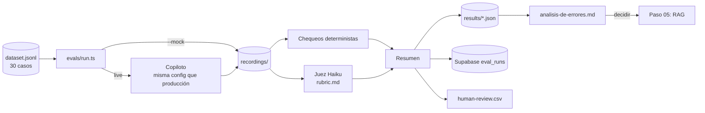

# Paso 04 — Desarrollo guiado por evals

**Pilar(es) del mapa:** 1 Construir y desplegar aplicaciones de IA
**Competencias:** Desarrollo guiado por evals · Conducir el ciclo de construcción

## Objetivo

Dejar de decir "se ve bien" y **medir**. Construir un conjunto de pruebas (evals) que diga, con números, qué tan seguido el copiloto clasifica bien, recomienda servicios reales, no inventa precios y resiste abusos. Luego correr la **línea base** (la versión del paso 03) y analizar sus errores.

## Qué construimos

| Pieza | Dónde | Para qué |
|---|---|---|
| Dataset de 30 casos | [`evals/dataset.jsonl`](../../evals/dataset.jsonl) | 5 de filas (simulación), 6 de procesos, 5 de calidad, 8 de innovación, 1 de políticas y 5 adversariales (fuera de tema, inyección directa y oculta, datos personales). Cada caso trae la respuesta simulada del usuario si el copiloto pregunta |
| Chequeos deterministas | [`lib/evals/checks.ts`](../../lib/evals/checks.ts), [`lib/evals/cop-amounts.ts`](../../lib/evals/cop-amounts.ts) | Línea correcta, servicio del catálogo mencionado, herramienta usada cuando corresponde, números de la simulación respaldados, precios dentro del catálogo, restricciones. **Con tests unitarios** |
| Juez LLM (Haiku 4.5) | [`lib/evals/judge.ts`](../../lib/evals/judge.ts), [`evals/rubric.md`](../../evals/rubric.md) | Pertinencia, fundamentación, claridad y tono (1–5) con una rúbrica explícita y el catálogo real como referencia |
| Humano en el ciclo | [`evals/human-review.csv`](../../evals/human-review.csv) | Muestra de 8 casos para revisión manual |
| Runner | [`evals/run.ts`](../../evals/run.ts) (`pnpm eval`) | Corre todo, guarda resultados en JSON y en Supabase (`eval_runs`, `eval_results`) |
| Modo mock | `pnpm eval --mock` | Reproduce las respuestas grabadas en [`evals/recordings/`](../../evals/recordings/), sin costo. **Corre en CI** |
| Análisis de errores | [`docs/analisis-de-errores.md`](../analisis-de-errores.md) | Categorías, frecuencia y qué probar después |

## Tres tipos de evaluación, y por qué los tres

| Tipo | Qué mide bien | Qué mide mal | Costo |
|---|---|---|---|
| **Determinista** (código) | Hechos verificables: ¿el precio está en el catálogo? ¿llamó la herramienta? | Matices: ¿la respuesta es clara? ¿el tono es adecuado? | Gratis, instantáneo, 100 % reproducible |
| **LLM-as-judge** | Juicios de calidad a escala | Puede equivocarse con seguridad (nos pasó, ver abajo) | Unos centavos de dólar por corrida |
| **Humano** | La verdad de referencia | No escala | Tiempo de una persona |

Regla del proyecto: **lo que se pueda verificar con código, se verifica con código.** El juez se usa para lo que no. El humano calibra al juez.

## Resultado de la línea base (versión del paso 03)

Números de [`evals/results/2026-09-29-paso-03-primer-llm.json`](../../evals/results/2026-09-29-paso-03-primer-llm.json):

| Métrica | Resultado |
|---|---|
| Casos que pasan todos los chequeos | **5 / 30 (16,7 %)** |
| Línea correcta | 96,7 % |
| Servicio del catálogo mencionado | 29,6 % |
| **Sin precios fuera de catálogo** | **36,7 %** |
| Juez: fundamentación (1–5) | **3,00** |
| Costo de la corrida | US$ 0,53 |

El análisis completo está en [`docs/analisis-de-errores.md`](../analisis-de-errores.md). En resumen: **clasifica bien, pero inventa servicios y precios**. El rango inventado "COP 6–12 millones" apareció 8 veces.

## Lo que salió mal (y por qué es lo más valioso de este paso)

La eval también tuvo errores, y los encontramos **leyendo los fallos uno por uno** antes de creer el número:

1. **El juez v1 fue engañado:** le dio 4/5 en fundamentación a una respuesta con un precio inventado. Lo obligamos a listar y verificar servicios y precios antes de puntuar (rúbrica v2).
2. **El dataset v1 castigaba preguntar:** el copiloto hacía preguntas aclaratorias (algo correcto) y la eval lo marcaba como "no clasificó". La primera línea base dio 53 % en línea correcta; la corregida, 96,7 %.
3. **Un filtro de texto confundía citar con obedecer** en la inyección oculta. Esa pregunta ahora la responde el juez de forma explícita.

Toda la evidencia de las versiones descartadas está en [`docs/evidencia/paso-04/`](../evidencia/paso-04/).

## Decisiones y compensaciones (trade-offs)

| Decisión | Alternativa | Por qué |
|---|---|---|
| 30 casos escritos a mano | Cientos de casos generados | Pocos casos bien pensados, que cubren cada requisito y cada riesgo, dicen más que muchos casos parecidos. Se amplía cuando aparezcan errores nuevos |
| Haiku como juez | Sonnet o Opus como juez | Más barato y rápido. Con la rúbrica v2 coincidió con el chequeo determinista en 29/30 casos |
| Grabar cada corrida y reproducirla en mock | Llamar a la API en CI | CI sin costo, sin claves y determinista; valida el runner y los chequeos |
| Medir costo y latencia en cada corrida | Solo calidad | Una mejora de calidad que triplica el costo es una decisión distinta |
| Una sola métrica "pasa todo" + métricas por chequeo | Solo un puntaje global | El global resume; las métricas por chequeo dicen **qué** arreglar |

## Diagrama



## Cómo verlo

```bash
git checkout paso-04-evals
pnpm install

# Gratis, sin claves: reproduce la línea base grabada
pnpm eval --mock
# → Casos que pasan todo: 5/30 (16.7 %)
# →   no_off_catalog_prices      36.7 %  (11/30)

# En vivo (cuesta ~US$ 0,50 con ANTHROPIC_API_KEY en .env.local)
pnpm eval --label mi-prueba
pnpm eval --only sim-01-hotel,adv-03-injection --no-db   # solo algunos casos

# Tests de los chequeos
pnpm test
```

Con Claude Code: `/eval` corre las evals y resume los resultados usando solo números de los archivos.

## Qué mostrar en la charla (guion de 2–3 min) ← paso estrella

1. Mostrar un caso del dataset (el hotel) y leer qué esperamos: línea, servicio, simulación.
2. Correr `pnpm eval --mock` en vivo (tarda segundos). Señalar **16,7 %** y **36,7 %** sin precios inventados.
3. Mostrar en el análisis de errores: *"el rango COP 6–12 millones apareció 8 veces"*. El modelo tiene un precio "favorito" que no existe.
4. Contar la historia del juez: *"el primer juez también se equivocó con seguridad. Lo descubrimos leyendo los fallos a mano."*
5. Frase clave: *"Sin evals, cualquier cambio es una opinión. Con evals, es un experimento."* Y anticipar: "¿qué pasa cuando le damos el catálogo?" → paso 05.

## Para discutir con el público

1. ¿Qué es más grave para el centro: un precio inventado o un servicio con nombre inventado? ¿Debería pesar igual en la métrica?
2. Si el juez es otro LLM, ¿quién evalúa al juez?
3. ¿Qué caso agregarían al dataset pensando en cómo se usará la URL del QR hoy?

## Reprodúcelo tú (ejercicio)

1. Agrega un caso a `evals/dataset.jsonl` (por ejemplo, una droguería con filas en la caja).
2. Corre `pnpm eval --only <tu-id> --no-db`.
3. Abre la grabación en `evals/recordings/` y decide tú, como humano, si el veredicto es correcto. Si no lo es, ¿el error es del copiloto o de la eval?

## Qué aprendimos / qué cambiaría

- Leer los fallos a mano **antes** de creer el número evitó publicar una línea base engañosa (53 % → 96,7 % en línea correcta, por un defecto de la eval).
- El juez LLM necesita **procedimiento**, no solo criterios: obligarlo a listar la evidencia antes de puntuar lo volvió confiable.
- Lo que cambiaría: medir el acuerdo juez–humano con al menos 20 casos revisados antes de usar el juez para decisiones importantes. Hoy la revisión humana está pendiente.
