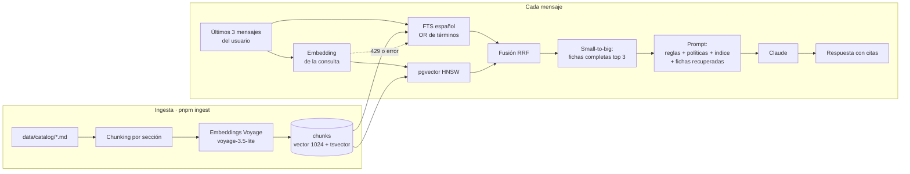

# Paso 05 — Fundamentar con datos (RAG)

**Pilar(es) del mapa:** 1 Construir y desplegar aplicaciones de IA
**Competencias:** Fundamentar con datos · Desarrollo guiado por evals · Gestión de datos

## Objetivo

Dejar de inventar. El análisis de errores del paso 04 mostró que el modelo clasificaba bien, pero inventaba servicios (70 % de los casos) y precios (63 %). La hipótesis: si el modelo **recupera** las fichas reales del catálogo y se le exige **citarlas**, esos errores desaparecen. Lo medimos.

## Qué construimos

| Pieza | Dónde |
|---|---|
| Ingesta: chunking por sección de Markdown, embeddings (Voyage `voyage-3.5-lite`) y checksums | [`scripts/ingest.ts`](../../scripts/ingest.ts), [`lib/rag/chunking.ts`](../../lib/rag/chunking.ts) |
| Búsqueda híbrida en SQL: texto completo en español + pgvector, fusionados con RRF | [`supabase/migrations/…_match_chunks.sql`](../../supabase/migrations/20260929170000_match_chunks.sql) |
| Recuperación con **respaldo a FTS** si Voyage falla o limita | [`lib/rag/search.ts`](../../lib/rag/search.ts), [`lib/rag/embeddings.ts`](../../lib/rag/embeddings.ts) |
| Prompt `v2-rag`: políticas e índice de servicios en el prompt; fichas completas por recuperación; **citas obligatorias** | [`lib/ai/prompts.ts`](../../lib/ai/prompts.ts) |
| Eval del recuperador por separado (recall@3) y prueba de paráfrasis | [`scripts/experiments/retrieval-eval.ts`](../../scripts/experiments/retrieval-eval.ts), [`retrieval-paraphrase.ts`](../../scripts/experiments/retrieval-paraphrase.ts) |
| Chequeo nuevo `cites_catalog` y comparación entre versiones con los mismos chequeos | [`lib/evals/checks.ts`](../../lib/evals/checks.ts), [`evals/compare.ts`](../../evals/compare.ts) |

## ¿Qué va en el prompt y qué va en recuperación?

| Contenido | Dónde | Por qué |
|---|---|---|
| Reglas, tono, límites | Prompt (con caché) | Aplica siempre |
| Las 3 **políticas** (atención, tarifas, datos) | Prompt (con caché) | Son cortas y casi siempre relevantes (descuentos, confidencialidad) |
| **Índice** de servicios: id, nombre y línea, **sin precios** | Prompt (con caché) | Así el modelo nunca inventa un nombre de servicio |
| **Fichas completas**: precios, entregables, duración | Recuperación (por mensaje) | Son el detalle que cambia según el caso, y crecerían si el catálogo crece |

Técnica **small-to-big**: la búsqueda compara contra fragmentos pequeños (secciones), pero al modelo se le entrega la **ficha completa** de los 3 mejores servicios. Así nunca ve un precio suelto sin el servicio al que pertenece.

### ¿Y un grafo de conocimiento?

Un grafo sirve cuando las **relaciones** entre entidades son el conocimiento (por ejemplo, "qué proveedor abastece a qué planta, que exporta a qué país"). Aquí tenemos 13 documentos independientes, sin relaciones importantes entre ellos: la pregunta siempre es "¿qué ficha aplica a este problema?". Un grafo agregaría complejidad sin mejorar nada medible. Es la regla de **simplicidad** de [`arquitectura.md`](../arquitectura.md).

## Resultados (números reales)

### 1. El recuperador, por separado

¿El servicio esperado está entre los 3 documentos recuperados?

| Prueba | FTS (texto completo) | Híbrido (vector + texto) | Evidencia |
|---|---|---|---|
| 27 casos del dataset | **27/27 (100 %)**, p50 189 ms | 27/27 (100 %), p50 441 ms | [`retrieval-eval.json`](../evidencia/paso-05/retrieval-eval.json) |
| 8 **paráfrasis** sin palabras del catálogo ("la gente se aburre esperando para pagar") | 6/8 | **8/8** | [`retrieval-parafrasis.json`](../evidencia/paso-05/retrieval-parafrasis.json) |

Las consultas del dataset comparten palabras con el catálogo, y ahí basta el texto completo. Cuando la persona habla **con otras palabras** ("necesito plata del gobierno para una idea nueva"), solo la búsqueda vectorial encuentra la ficha.

### 2. El copiloto completo (30 casos)

Todas las versiones calificadas con **los mismos chequeos** ([`comparacion.json`](../../evals/results/comparacion.json)):


| Métrica | Paso 03 (solo prompt) | Paso 05 FTS | Paso 05 **híbrido** |
|---|---|---|---|
| Casos que pasan todo | 3/30 (10 %) | 23/30 (76,7 %) | **24/30 (80 %)** |
| Sin precios fuera de catálogo | 36,7 % | 96,7 % | **100 %** |
| Servicio real del catálogo | 29,6 % | 100 % | 100 % |
| Cita la ficha | 0 % | 96,3 % | 96,3 % |
| Línea correcta | 96,7 % | 100 % | 100 % |
| Simula en los 5 casos de filas | 0 % | 0 % | 0 % ← falta la herramienta (paso 06) |
| Juez: fundamentación (1–5) | 3,00 | 5,00 | 5,00 |
| Costo por caso | US$ 0,0117 | US$ 0,0172 | US$ 0,0181 |

> La línea base del paso 03 aparece con **3/30** (y no 5/30, como en el paso 04) porque ahora también se le aplica el chequeo de citas, que no existía cuando se grabó. Por eso comparamos siempre **re-calificando** todas las versiones con los chequeos actuales.

**Sobre la latencia:** la corrida híbrida marca p50 de 35,6 s por turno, pero **no es representativa**. Incluye las esperas por el límite de Voyage sin método de pago (3 solicitudes por minuto), que la eval respeta a propósito. La latencia real de la recuperación híbrida es de ~0,4 s (ver la tabla del recuperador).

### Decisión

**Producción usa búsqueda híbrida, con respaldo automático a FTS.**
- Híbrido gana en paráfrasis (8/8 frente a 6/8) y en la eval completa (24 frente a 23; 100 % sin precios inventados frente a 96,7 %).
- El costo extra es ~0,25 s de latencia y una dependencia (Voyage).
- Si Voyage falla o limita, la búsqueda cae a FTS sin que el usuario lo note (y queda registrado).

## Decisiones y compensaciones (trade-offs)

| Decisión | Alternativa | Por qué |
|---|---|---|
| RAG sobre fichas | Meter el catálogo completo en el prompt | Con 10 fichas cabría (5.989 tokens, medido con la API `count_tokens`), pero no escala y encarece cada turno. Además, enseñar RAG es parte del objetivo |
| FTS con **OR** entre términos | `websearch_to_tsquery` (AND) | Con AND, un mensaje conversacional casi nunca coincide |
| Eval del recuperador **por separado** | Solo la eval de punta a punta | Si falla la respuesta, hay que saber si falló la búsqueda o el modelo |
| Reintentos ante 429 solo en ingesta y evals | Reintentar también en el chat | En el chat, esperar 25 s es peor que responder con FTS |

## Diagrama



## Cómo verlo

```bash
git checkout paso-05-rag
pnpm install
pnpm ingest                    # → 13 documents · 71 chunks (con VOYAGE_API_KEY)
pnpm eval --mock               # reproduce la última corrida grabada (híbrida)
pnpm eval:compare paso-03-primer-llm paso-05-rag-fts paso-05-rag-hybrid

# Eval del recuperador (FTS es gratis; híbrido usa Voyage)
pnpm tsx scripts/experiments/retrieval-eval.ts
pnpm tsx scripts/experiments/retrieval-paraphrase.ts

# Probar sin Voyage: la búsqueda cae a FTS
RAG_MODE=fts pnpm dev
```

En `/copilot`, abre "Bajo el capó": aparece el modo de recuperación (`hybrid` o `fts`) y las fichas recuperadas.

## Qué mostrar en la charla (guion de 2–3 min)

1. Repetir el caso del hotel. Ahora dice **COP 8.000.000 – 25.000.000**, igual que la ficha, con un enlace a la fuente.
2. Mostrar el gráfico de evals: **37 % → 100 %** sin precios inventados. Frase clave: *"No cambiamos el modelo. Cambiamos lo que el modelo sabe."*
3. Mostrar la prueba de paráfrasis: "botamos comida todos los días" → FTS no encuentra la ficha de desperdicios; la búsqueda vectorial sí.
4. Señalar la barra que **no subió**: 0 % de simulaciones en los casos de filas. *"El RAG le dio datos, pero todavía no calcula. Para eso necesita una herramienta."* → paso 06.

## Para discutir con el público

1. Si el catálogo tuviera 5.000 servicios, ¿qué cambiaría en este diseño?
2. ¿Cuándo preferirían FTS aunque la búsqueda vectorial sea mejor?
3. El copiloto supuso que el hotel tiene "hasta 10 empleados" para aplicar un descuento. ¿Cómo lo detectaríamos con una eval?

## Reprodúcelo tú (ejercicio)

1. Agrega una ficha nueva en `data/catalog/servicios/` (por ejemplo, "Logística de última milla") y corre `pnpm ingest`. Solo se procesa la ficha nueva (checksum).
2. Escribe 3 paráfrasis de un problema que esa ficha resuelve y agrégalas a `retrieval-paraphrase.ts`.
3. Compara FTS contra híbrido. ¿Coincide con lo que encontramos?

## Qué aprendimos / qué cambiaría

- **El mayor salto de calidad del proyecto vino de los datos, no del modelo:** de 10 % a 80 % de casos que pasan todo.
- Hay que **evaluar el recuperador por separado**: la eval completa no habría mostrado que FTS falla con paráfrasis, porque nuestro dataset no tenía casos así.
- **Límites externos reales:** Voyage sin método de pago permite 3 solicitudes por minuto. El diseño con respaldo a FTS lo convirtió en un problema de latencia, no de caída.
- Error persistente: el copiloto a veces **supone datos** que nadie dio (el número de empleados para aplicar un descuento). Se aborda en el prompt del paso 06.
- Lo que cambiaría: agregar paráfrasis al dataset principal de evals para que la ventaja del híbrido se vea también en la eval completa.
