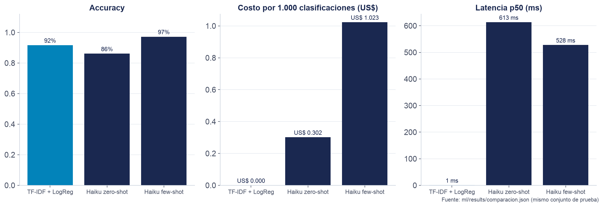
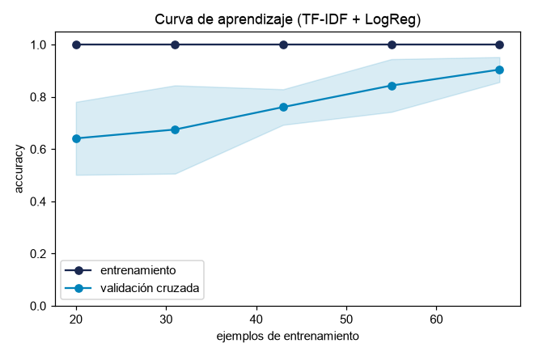
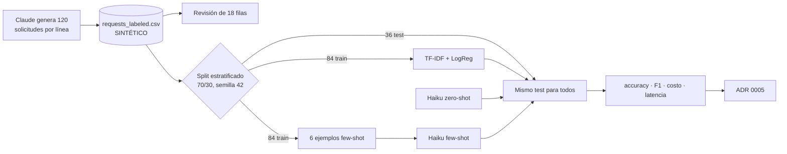

# Paso 07 — ML clásico frente a LLM

**Pilar(es) del mapa:** 1 Construir y desplegar aplicaciones de IA · 4 Dar forma a lo que se construye
**Competencias:** Fundamentos de ML · Tomar decisiones de producto

## Objetivo

No todo problema necesita un LLM. Para una tarea acotada, clasificar una solicitud en 3 líneas, comparamos un modelo **clásico** (TF-IDF + regresión logística) con un **LLM** (Claude Haiku 4.5), midiendo calidad, costo y latencia en el **mismo** conjunto de prueba. Y decidimos con esos números.

## Qué construimos

| Pieza | Dónde |
|---|---|
| Generador del dataset **sintético** (120 solicitudes, 40 por línea, con variedad forzada de sector, tamaño y estilo) | [`scripts/ml/generate-requests.ts`](../../scripts/ml/generate-requests.ts) |
| Dataset | [`ml/data/requests_labeled.csv`](../../ml/data/requests_labeled.csv) |
| Muestra revisada (18 filas) | [`ml/data/muestra-revisada.csv`](../../ml/data/muestra-revisada.csv) |
| Notebook ejecutado **con salidas guardadas** | [`ml/clasificador.ipynb`](../../ml/clasificador.ipynb) (fuente legible: [`ml/build_notebook.py`](../../ml/build_notebook.py)) |
| Resultados | [`ml/results/comparacion.json`](../../ml/results/comparacion.json) y figuras en [`ml/results/`](../../ml/results/) |
| Decisión | [ADR 0005](../adr/0005-clasificador.md) |

### Sobre los datos (léelo antes de creer los números)

- Los textos los escribió **Claude Sonnet 5.5** a partir de una línea dada. La etiqueta es la del **pedido**, no una predicción.
- Se prohibió mencionar la línea o el servicio, y una tanda por línea usa un estilo "confuso" que mezcla temas.
- **Revisión:** el agente de código leyó 18 filas (6 por línea): 16 claras y 2 ambiguas, justo de la tanda "confusa". **Falta la revisión humana.**
- Costo de generar el dataset: US$ 0,19.

## Resultados (mismo conjunto de prueba: 36 casos, 12 por línea)



| Modelo | Accuracy | F1 macro | Costo por 1.000 clasificaciones | Latencia p50 |
|---|---|---|---|---|
| TF-IDF + regresión logística | 91,7 % (33/36) | 0,916 | ≈ US$ 0 (local) | **0,6 ms** |
| Haiku 4.5 zero-shot | 86,1 % (31/36) | 0,861 | US$ 0,30 | 613 ms |
| Haiku 4.5 few-shot (6 ejemplos) | **97,2 %** (35/36) | 0,972 | US$ 1,02 | 528 ms |

**Sesgo y varianza:** el modelo clásico tiene 100 % en entrenamiento y la validación cruzada sube de 64 % a 90 % al pasar de 20 a 67 ejemplos. Es **varianza alta**: memoriza, y con más datos (reales) seguiría mejorando.



**Ojo con la estadística:** con 36 casos, cada acierto vale 2,8 puntos. Entre TF-IDF y Haiku few-shot hay 2 casos de diferencia: es una señal, no una prueba.

## Decisión ([ADR 0005](../adr/0005-clasificador.md))

- **En la conversación, clasifica el agente** (ya lee el caso completo, pregunta si hay ambigüedad y el costo va incluido en el turno).
- **Para triage masivo y monitoreo, el modelo clásico:** es ~1.000 veces más rápido, gratis y suficiente para estadísticas agregadas (lo usamos en el paso 09 para etiquetar el tráfico y detectar *drift*).
- **Haiku few-shot** queda como opción si algún día hace falta un clasificador separado y preciso.

## Decisiones y compensaciones (trade-offs)

| Decisión | Alternativa | Por qué |
|---|---|---|
| Datos sintéticos generados por línea | Etiquetar a mano solicitudes reales | No tenemos datos reales (demo). Se declara en el notebook, en este doc y en el ADR |
| TF-IDF de palabras **y** de caracteres | Solo palabras | Los caracteres toleran faltas de ortografía y variantes del español coloquial |
| `temperature=0` en Haiku | Valor por defecto | Clasificación reproducible |
| Few-shot con ejemplos del **train** | Ejemplos cualquiera | Usar ejemplos del test sería hacer trampa (fuga de datos) |

## Diagrama



## Cómo verlo

```bash
git checkout paso-07-ml-clasico
/opt/homebrew/bin/python3.12 -m venv .venv    # o cualquier Python ≥ 3.11
.venv/bin/pip install -r ml/requirements.txt

# Ver el notebook con sus salidas: ábrelo en GitHub o en Jupyter
.venv/bin/jupyter lab ml/clasificador.ipynb

# Volver a ejecutarlo (llama a Haiku: ~72 llamadas, menos de US$ 0,05)
set -a; source .env.local; set +a
.venv/bin/jupyter nbconvert --to notebook --execute --inplace ml/clasificador.ipynb
```

## Qué mostrar en la charla (guion de 2–3 min)

1. La tabla: *"una técnica estadística de hace décadas contra un LLM de 2025"*. El clásico queda a 2 casos del mejor LLM, es gratis y responde en menos de un milisegundo.
2. La curva de aprendizaje: *"sigue subiendo. No necesita un modelo más grande; necesita más datos reales."*
3. La decisión: cada herramienta donde rinde. *"Saber cuándo **no** usar un LLM también es AI Engineering."*

## Para discutir con el público

1. ¿Qué cambiaría si el centro recibiera 100.000 solicitudes al mes?
2. ¿Qué riesgo hay en entrenar un clasificador con textos que escribió otro LLM?
3. ¿Cómo conseguirían datos reales etiquetados sin mucho esfuerzo? (Pista: el panel del paso 08.)

## Reprodúcelo tú (ejercicio)

1. Agrega 20 solicitudes reales (o escritas por ti) a `ml/data/requests_labeled.csv`.
2. Vuelve a ejecutar el notebook. ¿Cambió la curva de aprendizaje? ¿Y el orden de los modelos?
3. Prueba quitar los n-gramas de caracteres. ¿Cuánto baja la accuracy?

## Qué aprendimos / qué cambiaría

- En una tarea acotada, **el modelo clásico compite**: 91,7 % frente a 97,2 %, a costo y latencia casi nulos.
- **El few-shot cambió mucho al LLM** (86,1 % → 97,2 %) con solo 6 ejemplos: los ejemplos valen más que las definiciones.
- El SDK de Python 1.x **eliminó `temperature`** de su firma (la API la sigue aceptando en Haiku 4.5). Se envía con `extra_body`.
- Lo que cambiaría: más casos de prueba (con 36 las diferencias no son concluyentes) y revisión humana de todo el dataset.
