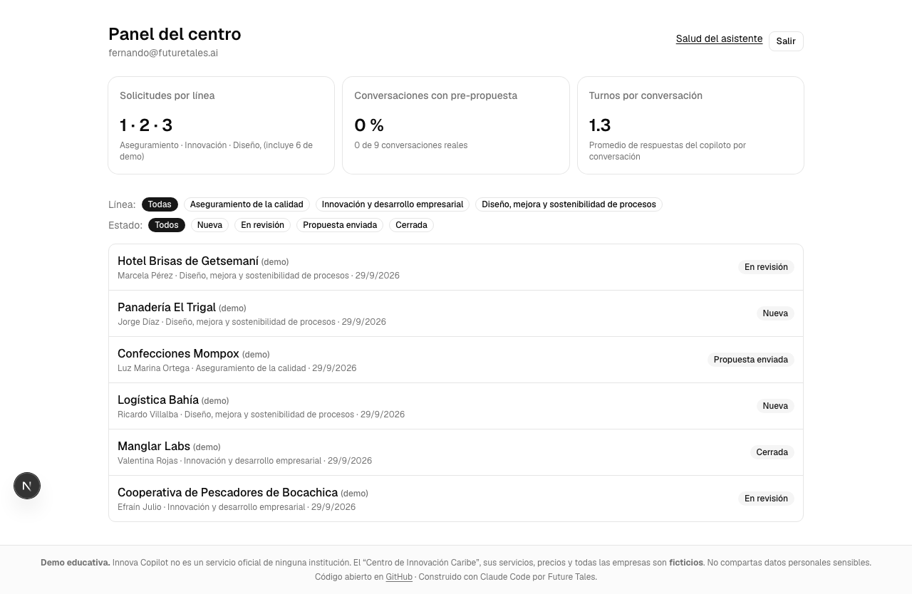
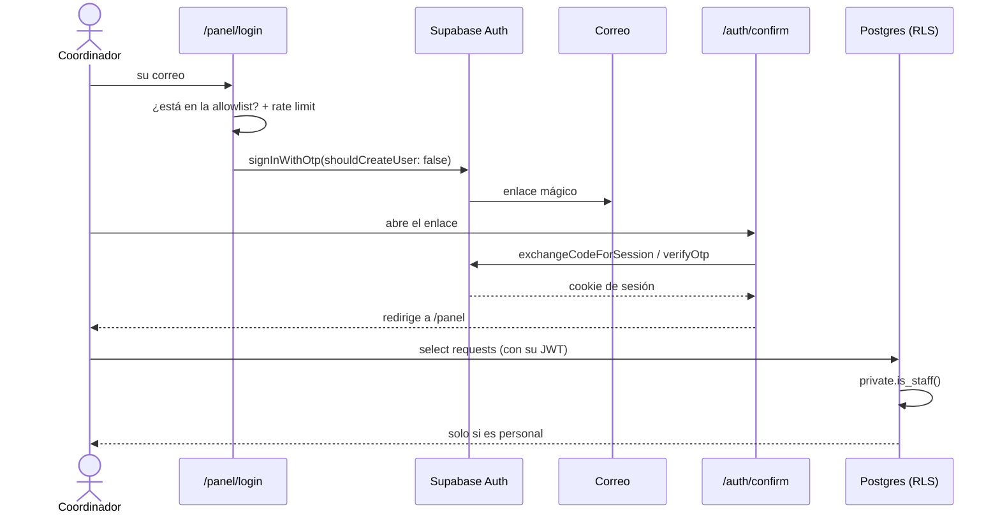

# Paso 08 — Producto completo: panel, pruebas, CI y revisión agéntica

**Pilar(es) del mapa:** 2 Fundamentos de ingeniería de software · 3 Uso de agentes de código
**Competencias:** Aplicaciones full-stack · Seguridad y fiabilidad · Revisar el trabajo

## Objetivo

Cerrar el producto del lado del centro (el panel para el coordinador) y **revisarlo todo** antes de ponerlo frente al público: pruebas automáticas, CI completo y una revisión independiente de seguridad hecha por un subagente.

## Qué construimos

| Pieza | Dónde |
|---|---|
| `/panel` con login por **enlace mágico** (Supabase Auth), solo para la allowlist del personal; **registro público desactivado** | [`app/panel/`](../../app/panel/), [`app/auth/confirm/route.ts`](../../app/auth/confirm/route.ts), [`proxy.ts`](../../proxy.ts) |
| Lista de solicitudes filtrable por línea y estado, detalle, y 3 KPIs (solicitudes por línea, % de conversaciones con pre-propuesta, turnos por conversación) | [`app/panel/page.tsx`](../../app/panel/page.tsx) |
| Todas las consultas del panel **como el usuario conectado**: decide el RLS, no el código | [`lib/supabase/server.ts`](../../lib/supabase/server.ts) |
| Tests: 65 unitarios (simulación, guardrails de entrada, chequeos de evals, catálogo, chunking, drift) y e2e con Playwright en modo mock (escritorio y celular, con chequeo de accesibilidad básico) | [`tests/`](../../tests/) |
| CI completo: gitleaks (hash fijado), lint, typecheck, tests, **evals mock**, build y **e2e** | [`.github/workflows/ci.yml`](../../.github/workflows/ci.yml) |
| **Revisión agéntica** y auditoría de seguridad, con sus correcciones | [`docs/revision-agentica.md`](../revision-agentica.md) |



## La revisión agéntica (lo más importante de este paso)

Un subagente revisor, de solo lectura y con contexto limpio, dio **`NOT READY`**, con 3 hallazgos graves:

1. **Saltar el tope diario** con un historial inventado.
2. **Inflar el costo** con un historial enorme (el límite solo miraba el último mensaje).
3. **Colgar el servidor** con una simulación gigante.

Además encontró que las aprobaciones de herramientas no estaban firmadas, y varios detalles menores. Todos los graves y medios quedaron corregidos **y verificados en vivo** ([evidencia](../evidencia/paso-08/verificacion-correcciones.md)); dos riesgos se aceptaron con su motivo por escrito. Detalle completo en [`revision-agentica.md`](../revision-agentica.md).

## Decisiones y compensaciones (trade-offs)

| Decisión | Alternativa | Por qué |
|---|---|---|
| Enlace mágico + allowlist, registro desactivado | Usuario y contraseña | Sin contraseñas que filtrar; nadie puede crear cuentas con la clave pública |
| Cuenta del personal creada por la API de administración | Autoregistro | Coherente con el registro desactivado |
| El panel consulta con la sesión del usuario (RLS) | Service role en el servidor | Si hay un bug en la página, el RLS sigue protegiendo los datos |
| E2E en modo mock y sin claves | E2E contra la API real | Gratis, determinista, y además prueba el plan B |
| `getClaims()` en el servidor | `getSession()` | `getSession()` no valida el JWT (documentación de Supabase) |
| Probar el login con un enlace generado por la API de administración | Enviar un correo real | Prueba el flujo completo sin llenar la bandeja de nadie |

## Diagrama



## Cómo verlo

```bash
git checkout paso-08-producto-completo
pnpm install
pnpm test                         # 65 tests
pnpm test:e2e                     # Playwright en modo mock, sin claves
pnpm tsx scripts/e2e-panel-login.mts http://localhost:3000   # login real sin enviar correo (con pnpm dev corriendo)
```

En producción: https://innova-copilot.vercel.app/panel (solo personal autorizado).

## Qué mostrar en la charla (guion de 2–3 min)

1. El panel con la pre-propuesta del hotel que se guardó en la demo en vivo.
2. La tabla de la revisión agéntica: *"Yo escribí los guardrails y los probé. El revisor encontró tres formas de disparar la factura en 7 minutos."*
3. Frase clave: *"El agente que escribe no debería ser el único que revisa. Ni siquiera cuando el que escribe es un agente."*

## Para discutir con el público

1. ¿Por qué el revisor encontró lo que el autor no vio, si es el mismo modelo?
2. De los riesgos aceptados, ¿cuál aceptarían ustedes y cuál no?
3. ¿Qué parte de esta revisión debería ser humana siempre?

## Reprodúcelo tú (ejercicio)

1. En Claude Code, escribe `/revisar` sobre un cambio tuyo (usa el subagente `code-reviewer`).
2. Para cada hallazgo, escribe primero una prueba que falle y luego corrígelo.
3. Clasifica los hallazgos que no corriges: ¿por qué es aceptable el riesgo?

## Qué aprendimos / qué cambiaría

- **`config push` de Supabase sube todo `config.toml`**, no solo lo que cambiaste: al desactivar el registro, también bajó la longitud del código OTP y apagó la confirmación de correo, porque esos eran los valores locales por defecto. Lo vimos en el diff, lo revertimos y verificamos que el remoto quedara igual al local.
- La revisión cuestionó un supuesto de fondo: **el historial que envía el cliente no es confiable**. La solución de raíz (guardar el historial en el servidor) queda para la v2.
- Lo que cambiaría: correr la revisión agéntica **en cada PR** en CI, no solo al final.
