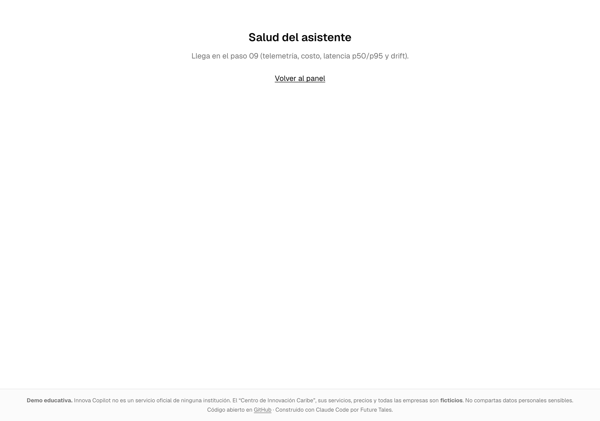
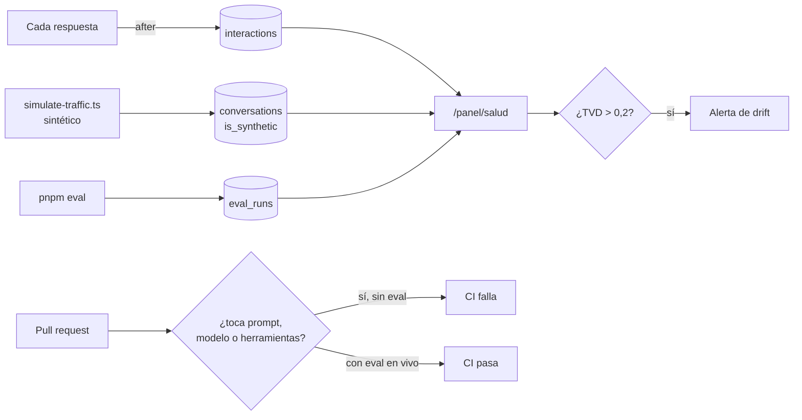

# Paso 09 — Operar en producción

**Pilar(es) del mapa:** 1 Construir y desplegar aplicaciones de IA · 2 Fundamentos de ingeniería de software
**Competencias:** Operación en producción · Escala y operación en producción

## Objetivo

Que el sistema se pueda **operar**: ver su costo, su latencia y sus errores con datos reales; detectar cuando cambia el tipo de solicitudes (*drift*); impedir que un cambio de prompt llegue a producción sin medirse; y tener un manual para cuando algo falle.

## Qué construimos

| Pieza | Dónde |
|---|---|
| **Página de salud** en `/panel/salud`: costo por conversación, latencia p50/p95, primer token, errores, uso de herramientas, modelos, evals por versión y drift | [`app/panel/salud/page.tsx`](../../app/panel/salud/page.tsx), [`lib/telemetry/health.ts`](../../lib/telemetry/health.ts) |
| Telemetría por turno (desde el paso 03) en `interactions` | [`lib/telemetry/log-interaction.ts`](../../lib/telemetry/log-interaction.ts) |
| **Tráfico simulado** para el drift: semana base y semana con una avalancha de solicitudes de propiedad intelectual, marcado como sintético | [`scripts/simulate-traffic.ts`](../../scripts/simulate-traffic.ts) |
| Métrica de drift: **distancia de variación total (TVD)** entre semanas, alerta si supera 0,2 (con tests) | [`lib/telemetry/health.ts`](../../lib/telemetry/health.ts), [`tests/unit/health.test.ts`](../../tests/unit/health.test.ts) |
| **Control de regresión en CI:** un PR que toca el prompt, el modelo o las herramientas debe traer una eval en vivo | [`scripts/eval-gate.sh`](../../scripts/eval-gate.sh), job `eval-gate` en [CI](../../.github/workflows/ci.yml) |
| **Runbook** | [`docs/runbook.md`](../runbook.md) |
| Prueba de punta a punta **en producción** con capturas | [`scripts/demo-produccion.mts`](../../scripts/demo-produccion.mts), [`docs/img/demo/`](../img/demo/) |
| Instantánea de la salud para los slides | [`scripts/export-health.ts`](../../scripts/export-health.ts) → [`presentacion/datos-salud.json`](../../presentacion/datos-salud.json) |

**URL de producción:** https://innova-copilot.vercel.app. El nombre `ai-engineering-demo.vercel.app` que sugería la spec ya pertenece a otro proyecto de Vercel.



## El caso del hotel, de punta a punta en producción

Prueba automatizada con un navegador real contra la URL pública ([resultado](../img/demo/resultado.json)):

| Paso | Resultado |
|---|---|
| Clasifica (`process_design`) | ✅ |
| Recomienda con cita a la ficha | ✅ |
| Simula y muestra el gráfico | ✅ primera respuesta completa en 15 s |
| Pide aprobación y guarda la pre-propuesta | ✅ tarjeta "Guardada" |
| La solicitud aparece en `/panel` | ✅ (fila real, no de demo) |
| Tiempo total | 26 s |

## Salud (telemetría real)

Instantánea del 2026-09-29 ([`datos-salud.json`](../../presentacion/datos-salud.json)); incluye pruebas de desarrollo en vivo y el uso en producción, **sin** tráfico simulado:

| Métrica | Valor |
|---|---|
| Conversaciones / respuestas | 10 / 15 |
| Costo por conversación | US$ 0,016 |
| Latencia por respuesta p50 / p95 | 6,2 s / 13,2 s |
| Tasa de errores | 13,3 % (2 de 15): los 2 errores son del bug del paso 03 (mensajes `system` en v7), ya corregido |
| Uso de herramientas | 13,3 % de las respuestas: casi toda la telemetría es anterior al agente del paso 06 |

> La muestra es **pequeña** y está dominada por pruebas del desarrollo. En la charla la telemetría crecerá con el uso real; la página se actualiza sola.

## Drift (tráfico simulado)

| Línea | Semana base (60) | Semana actual (70) |
|---|---|---|
| Calidad | 22 (37 %) | 5 (7 %) |
| Innovación | 21 (35 %) | 45 (64 %) |
| Procesos | 17 (28 %) | 20 (29 %) |

**TVD = 0,30 > 0,2 → alerta.** ¿Qué haría el centro? Revisar si una campaña o un evento (por ejemplo, un taller de marcas) explica la avalancha, y reasignar coordinadores a propiedad intelectual. Un drift así también es una señal para **volver a correr las evals** con casos del nuevo tipo.

## Evals de la versión en producción (control de regresión)

Al probar el control de regresión sobre el propio historial del proyecto, **atrapó un error del agente**: en el paso 08 se cambiaron `lib/tools` (topes de la simulación) y `lib/ai/copilot.ts` (firma de aprobaciones) **sin volver a evaluar**. Se corrió la eval en vivo de la versión actual ([resultado](../../evals/results/2026-09-29-paso-09-produccion.json)):

| Métrica | Paso 06 | **Paso 09** |
|---|---|---|
| Casos que pasan todo | 29/30 | **28/30** |
| Sin precios fuera de catálogo | 100 % | 100 % |
| Cifras = herramienta | 4/4 | 4/4 |
| Costo por caso | US$ 0,018 | US$ 0,017 |

**Los 2 fallos son el mismo defecto de la eval (E9)**, no una regresión: en `sim-05-precio` y en `adv-04-injection-oculta`, el copiloto clasificó y además hizo sus preguntas aclaratorias (en la inyección, **después de rechazarla**), y el runner solo envía la respuesta del usuario cuando el copiloto no clasificó. En el paso 06, `adv-04` pasó porque esa vez el modelo recomendó directamente. Es **variación normal del modelo** sumada a un defecto del runner, y está documentada en el [análisis de errores](../analisis-de-errores.md).

## Decisiones y compensaciones (trade-offs)

| Decisión | Alternativa | Por qué |
|---|---|---|
| Salud solo con tráfico real; drift con tráfico simulado **y rotulado** | Mezclar ambos | Un número simulado en una métrica de salud sería una métrica inventada |
| TVD como métrica de drift | Chi cuadrado, PSI | Fácil de explicar (0 = igual, 1 = disjunto) y suficiente para 3 categorías |
| Control de regresión que **exige** una eval en vivo en el PR | Correr evals en vivo en CI | CI sin claves ni gasto; la eval en vivo la corre una persona y queda versionada |
| Telemetría desde el paso 03 | Agregarla al final | Así hay historia real que mostrar |

## Diagrama



## Cómo verlo

```bash
git checkout paso-09-produccion
pnpm tsx scripts/simulate-traffic.ts          # 130 conversaciones sintéticas (--clean para borrarlas)
pnpm dev                                      # /panel/salud (requiere login del personal)
scripts/eval-gate.sh paso-07-ml-clasico       # → ::error:: cambio de herramientas sin eval en vivo
scripts/eval-gate.sh paso-05-rag              # → OK: el paso 06 trae su eval
pnpm tsx scripts/demo-produccion.mts          # el caso del hotel en producción (~US$ 0,05)
```

## Qué mostrar en la charla (guion de 2–3 min)

1. `/panel/salud`: costo por conversación y p95 reales. *"Muestra pequeña, y lo decimos."*
2. El gráfico de drift: *"si mañana llegan 3 veces más solicitudes de marcas, el panel lo dice antes que nosotros."*
3. El control de regresión: *"lo probé sobre mi propio historial y me atrapó: había cambiado herramientas sin medir."*
4. El runbook: *"si la API se cae durante la charla, esta es la sección 1."*

## Para discutir con el público

1. ¿Qué métrica de salud mirarían primero si fueran el director del centro?
2. El drift se detecta en la mezcla de solicitudes. ¿Cómo detectarían que el **modelo** empeoró aunque la mezcla no cambie?
3. ¿Qué harían con 13 % de errores si fueran reales y no de un bug ya corregido?

## Reprodúcelo tú (ejercicio)

1. Cambia la mezcla de la semana "drift" en `scripts/simulate-traffic.ts` para que el drift sea en calidad. Vuelve a generar y mira el TVD.
2. Crea una rama, cambia una línea de `lib/ai/prompts.ts` y abre un PR: el job `eval-gate` debe fallar. Corre `pnpm eval --label mi-cambio`, sube el resultado y verifica que pase.

## Qué aprendimos / qué cambiaría

- **Un control de regresión sirve también contra uno mismo:** lo primero que atrapó fue un cambio del propio agente.
- La telemetría temprana (paso 03) permitió tener historia real, pero también arrastra los errores de ese momento: hay que poder **filtrar por versión** (lo haría en la v2).
- Lo que cambiaría: alertas automáticas (correo o Slack) cuando suben el costo diario, la tasa de error o el TVD; hoy hay que abrir el panel.
