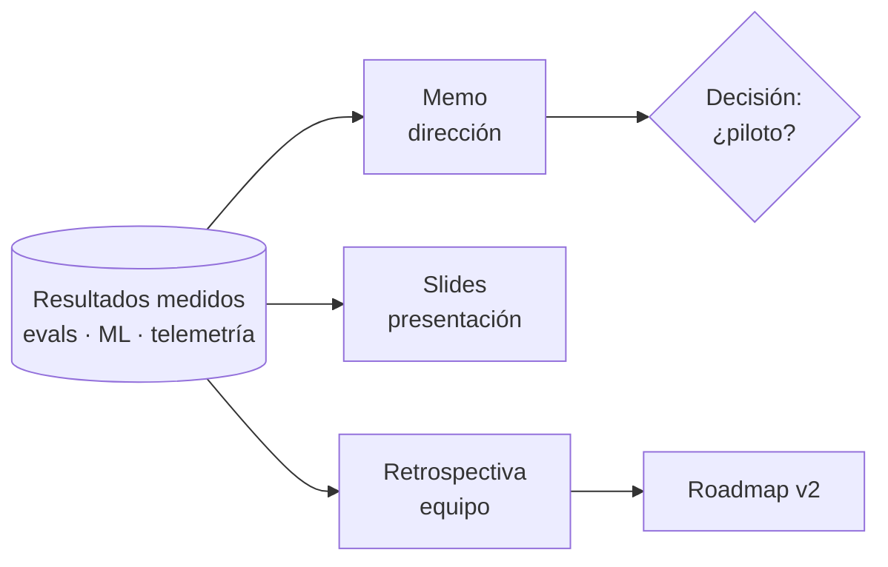

# Paso 10 — Cierre: comunicar, liderar y aprender

**Pilar(es) del mapa:** 4 Dar forma a lo que se construye · Base común
**Competencias:** Comunicar y liderar · Propiedad con alta agencia · Aprendizaje continuo

## Objetivo

Un sistema que nadie entiende ni financia no llega a producción real. Cerramos el proyecto contándolo **a cada audiencia en su idioma**: la dirección (un memo con números y una decisión que pedir), quien lo presente (slides) y quien construya después (retrospectiva y roadmap).

## La idea clave

Un sistema que nadie entiende ni financia no llega a producción real.

El [memo](../memo-stakeholders.md) muestra cómo contar este proyecto a una dirección: resultados con su fuente, lo que **no** se midió igual de visible, costos, riesgos y una decisión concreta que pedir. La [retrospectiva](../retrospectiva.md) es la otra mitad: qué falló, cómo se detectó cada error y qué se haría distinto. Juntos son probablemente los documentos más útiles para llevarte a tu propio proyecto.

## Qué construimos

| Pieza | Para quién | Dónde |
|---|---|---|
| Memo de una página: resultados, costos, riesgos y propuesta de piloto | Dirección de un centro de innovación | [`memo-stakeholders.md`](../memo-stakeholders.md) |
| Retrospectiva: qué funcionó, qué no, qué aprendimos con el agente de código | El equipo | [`retrospectiva.md`](../retrospectiva.md) |
| Roadmap v2: de demo a piloto | Quien siga el proyecto | [`roadmap-v2.md`](../roadmap-v2.md) |
| **Slides del caso práctico** (14, integrados al deck original) y QR | Quien presenta el proyecto | [`presentacion/`](../../presentacion/) |
| Notas del presentador: tiempos, demo en vivo y plan B | Quien presenta el proyecto | [`guion-charla.md`](../guion-charla.md) |
| Matriz competencia → paso → archivo | Quien quiere aprender | [`mapa-de-habilidades.md`](../mapa-de-habilidades.md) |
| Glosario (los términos del mapa + los nuevos) | Quien quiere aprender | [`glosario.md`](../glosario.md) |
| Portada del repo | Quien llega al proyecto | [`README.md`](../../README.md) |

## Decisiones y compensaciones (trade-offs)

| Decisión | Alternativa | Por qué |
|---|---|---|
| El memo **pide una decisión** concreta (piloto de 8 semanas y un coordinador) | Un informe descriptivo | Comunicar para liderar es proponer el siguiente paso, con criterios de éxito definidos antes |
| En el memo, lo que **no** medimos va tan visible como lo que sí | Solo buenas noticias | La confianza de la dirección vale más que un número bonito |
| Slides generados por código, con los números leídos de archivos | Armarlos a mano | Nada en pantalla que no tenga su fuente en el repo |
| Plan B en tres niveles: modo mock, capturas reales, runbook | Confiar en la conexión | Una demo en vivo es el momento de más riesgo de cualquier presentación |

## Diagrama



## Cómo verlo

```bash
git checkout paso-10-cierre
open presentacion/AI_Engineering_Skills_Caso_Practico.pdf   # o el .pptx
```

## Para pensar

1. ¿Qué le preguntaría un director financiero a este memo?
2. ¿Qué criterio de éxito agregarías al piloto?
3. De todo lo que hizo el agente de código, ¿qué no delegarías nunca?

## Pruébalo tú

Escribe el memo de una página de tu propio proyecto con esta estructura: **en una frase**, **qué medimos**, **qué no medimos**, **costos**, **riesgos y controles**, **la decisión que pides**. Si no tienes un número medido para una afirmación, bórrala.

## Qué aprendimos / qué cambiaría

- Comunicar bien obliga a **medir mejor**: al escribir el memo apareció que no teníamos ninguna métrica de negocio, y por eso el piloto existe.
- La matriz de habilidades terminó siendo el índice más útil del repo para enseñar.
- Lo que cambiaría: hacer el memo al **inicio** (junto a la spec) y actualizarlo en cada paso.
